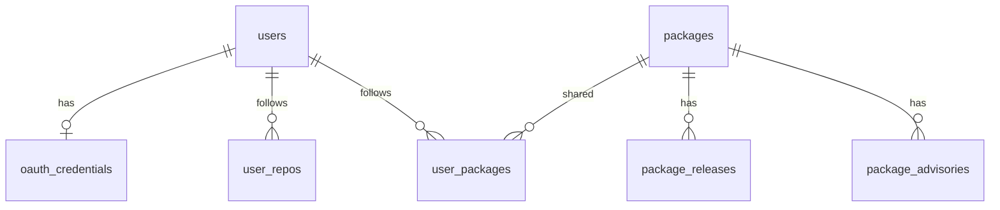

# OSS 収集（段階検証 1）

OAuth 画面も Beat の再発見もまだやらない。特定ユーザが GitHub 認可済みで、対象リポジトリが既に決まっている状態を静的データで固定し、その名簿から機械的に OSS 情報を集めて保存する。

## 固定する世界

`fixtures/world.json` が正本。2026-09-21 時点の Beat 切り（owner が `zaru` または `chobitapp`、直近 90 日 push）を写した。

| 項目 | 値 |
| --- | --- |
| ユーザ | `zaru`（github_id `235650`） |
| OAuth | 行がある = 認可済み。token は `fixture:authorized`（実トークンではない） |
| 対象リポ | 10。うち root `package.json` があるのは 8（`zaru/note` と `chobitapp/chobitmail-skills` は無し） |

収集の入力は `user_repos` だけ。viewer の再スキャンはしない。fixture の OAuth 行を `Authorization` に載せない。ライブ確認（`pnpm verify:ingest:live`）だけ `gh auth` を代用する。

マニフェストの依存名は `fixtures/world.json` の `manifests` に固定する。本文・スクリプトは置かない。

## データモデル（本番 D1、必要最低限）

`migrations/0001_catalog.sql`。スパイクの drift 表（`src/schema.sql`）は複製しない。連続テスト用に残し、本番カタログとは分ける。



| 表 | 主語 | メモ |
| --- | --- | --- |
| `users` | 人 | PK は github login（v1 の allowlist と同じ） |
| `oauth_credentials` | 人 | 暗号化 token。この段では存在だけを固定 |
| `user_repos` | 人×リポ | 特定済み Beat。日付スナップショットは後続 |
| `packages` | OSS | 共有カタログ。npm name が PK |
| `user_packages` | 人×OSS | 多対多。収集のたびにその人の follow を差し替える |
| `package_releases` | OSS | tag 単位。ユーザを持たない |
| `package_advisories` | OSS | GHSA 単位。ユーザを持たない |

Judgment / Story / Edition / cursor / pipeline_runs はこの段では作らない。

OSS をユーザの子にしない。同じ `wrangler` を二人で follow しても Releases は 1 本。再収集は GitHub をユーザ人数倍にしない。

## 収集手順

1. 対象ユーザの `included=1` な `user_repos` を読む
2. 各リポの root `package.json`（無い・壊れているなら skip）
3. `dependencies` と `devDependencies` のキー。deny は本番ワークフローと同じ（`@types/`、`eslint-`、`prettier`、`dotenv`、`postcss` など）。`TRACKED_PACKAGES` は使わない
4. `packages` を upsert。そのユーザの `user_packages` を tonight の名簿で置換
5. npm `repository` を正規化して `github_repo` / `npm_directory` を書く。GitHub 以外は unmapped（名簿には残す）
6. 同じ GitHub リポは Releases を 1 回だけ取る。`directory` がある、または複数パッケージが同じリポに載るなら monorepo とし、tag にパッケージ名を含むものだけ残す。body は 8 KiB
7. Advisories はパッケージ名ごと（公開 GHSA）

失敗はパッケージ単位で `incomplete` に入れ、全体は落とさない。

## 検証

```sh
pnpm verify              # fixture。ネットワーク無し
pnpm verify:ingest       # 同じ fixture を data/catalog.sqlite に書く
pnpm verify:ingest:live  # 固定リポのまま、npm / GitHub は実応答
```

`data/catalog.sqlite` は再実行してよい。`openCatalogDb` は未適用の migration だけ流す（D1 の `d1_migrations` 相当。本番 SQL には `IF NOT EXISTS` を足さない）。

テストが固定すること:

- zaru は認可済みでリポ 10
- deny と root 無しは名簿に入らない
- 二人 follow しても `packages` は 1 行、Releases も 1 本
- workers-sdk の `miniflare@` は wrangler に入らない

## 後続に残すもの

- OAuth の web flow と token の AES-GCM
- Beat の再発見（commit_share）
- `package_cursors` / Judgment / Story / 号 / メール
- Cloudflare Workflows への搭載
