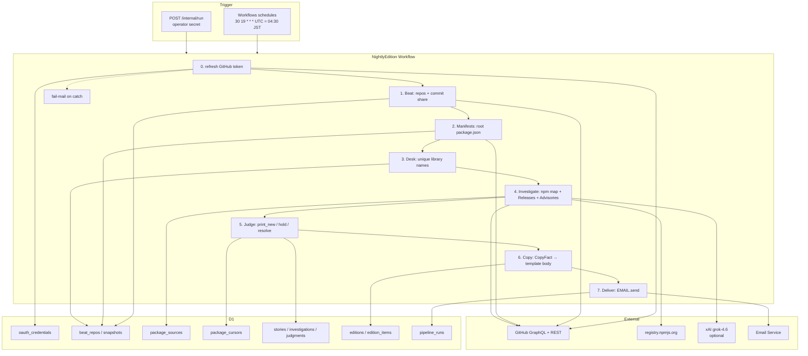
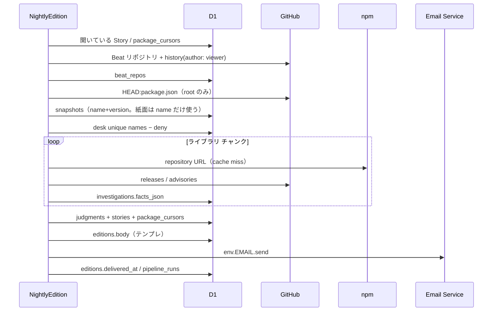
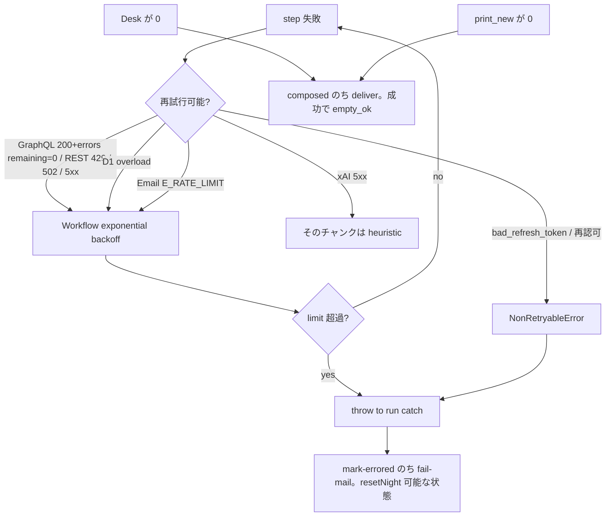

# chobitnews 本番ワークフロー設計

| 項目 | 値 |
| --- | --- |
| 文書 | chobitnews Production Workflow |
| 著者 | chobitnews |
| 日付 | 2026-09-21 |
| 状態 | Draft |
| 対象 | 単一ユーザー（`zaru`）、単一タイムゾーン（`Asia/Tokyo`）、1 暦日 1 号 |

検証スパイクはローカル Node（`gh auth`、`node:sqlite`、配信なし）で、Story 連続とテンプレ本文だけを確かめた。本ドキュメントは、その正本（`docs/検証結果.md`）を Cloudflare 上の毎晩の朝刊に載せる設計である。実装はしない。

---

## Overview

chobitnews は自分専用の GitHub 朝刊である。入力は GitHub 上のリポジトリだけで、ローカルパスは見ない。号（Edition）は毎日閉じてよい。地続きになる単位は Story で、Investigation と Judgment を翌朝の入力として残す。紙面の v1 は **Beat 上のライブラリ名簿に対する上流の最新（GitHub Releases / Advisories）** だけ。手元の使用バージョンと世代割れはニュースにしない。

本番は Cloudflare に置く。毎晩 04:30 JST に Cloudflare Workflows の `schedules` が 1 インスタンスを起こし、Beat → 名簿 → Investigation → Judgment → `CopyFact` → テンプレ号 → Email Sending、の順で進める。永続化は D1（スパイク `src/schema.sql` の正式 migration）。GitHub は GitHub App の user-to-server。本文はテンプレ必須、LLM（xAI `grok-4.6`）は任意で、落ちたらテンプレに戻す。空の朝（新ニュースなし）は成功である。

---

## Background & Motivation

### いまあるもの

スパイクの中心は `src/pipeline.ts` の `runNight` と `src/schema.sql`。テスト `test/continuity.test.ts` が、同じ inventory なら 2 日目は item 0・`hold`、揃ったら `resolve` だけ書くことを固定した。紙面品質は別軸で、手書き 1 号（`docs/紙面サンプル.md`、2026-09-21、4 項）が「内容は悪くない」を通し、同じ `CopyFact`（`src/copy.ts` / `src/sample-facts.ts`）からのテンプレが届くことを `docs/紙面生成.md` が示した。LLM の差は日付重複を消す程度。興味の本体は Investigation（どの点を残すか）と Judgment（何を hold するか）。

GitHub 取得は `src/github.ts` の GraphQL（`viewer.repositories`、`HEAD:package.json`、limit 40）。追跡対象は `src/inventory.ts` の `TRACKED_PACKAGES`（10 本）。Beat の切り方は検証結果に固定済みだが、パイプラインには未実装。

### 痛み

- 手元起動。朝 6 時に届かない。
- `gh auth` の user token。期限・権限・Refresh が本番向きではない。
- `node:sqlite` は Worker に載らない。
- 紙面方針は drift を捨てたのに、`runNight` はまだ drift 専用。
- 号の届け先がない。
- App 交差の範囲で、リポジトリ数十〜100 と unique ライブラリ数十〜107 の Releases は、1 本の Cron Worker に詰め込むと失敗時に最初からになる。

### 制約（製品）

- マルチテナント SaaS にしない。1 ユーザー。
- ソース全文を DB に積まない。マニフェスト、Investigation JSON、Judgment、Story、Edition body。
- cinema-ticketing / Durable Objects デモは GitHub に見える直近 root `package.json` に出ない。OAuth してもローカル専用は見えない。
- Contents API は専用なので許容する。
- パッケージマネージャは pnpm、Linter は Biome。コミットは日本語。

---

## Goals & Non-Goals

### Goals（v1）

1. JST の朝に、その暦日の号が 1 通届く。
2. Beat の主経路は **GitHub App を入れた owner（v1 は `zaru` と `chobitapp`）かつ直近 90 日 push**。token が見える他リポジトリに限り、デフォルトブランチ直近 30 日コミットの viewer 割合 ≥ 30% を足す。会社 org には App を入れない。`contributionsCollection` は使わない。
3. 名簿はライブラリ名。号は昨日以降（初号 lookback **21 日**）の上流。同じ latest を再掲載しない。紙面に出す hold は人間向け（古い major / パッチ羅列）だけ。
4. Investigation / Judgment / Story を D1 に残し、翌朝の入力にする。
5. 本文は `renderTemplateEdition`（`src/copy.ts`）。LLM なしで号が閉じる。
6. GitHub App user-to-server。PAT を Worker Secret に置いて運用しない。
7. 失敗は再試行し、偽のニュースを発明しない。空号は正規の号。
8. 一人運営に足りる観測（Workflow の step、構造化ログ、失敗メール）。

### Non-Goals（v1）

- 複数ユーザー、複数タイムゾーン、1 日複数号。
- Issue の熱、停滞と乗り換え、近傍 OSS、使い方指摘。
- 世代割れの紙面化（検証済みだが方針で捨てた）。
- リポジトリソースの全文保存、ローカル FS 走査。
- 本格 Web UI / 設定画面 / 購読管理。
- Workers AI を本文生成の主経路にすること。
- OpenAI / Anthropic / Gemini を主 LLM にすること。
- GitHub App 未インストール org の穴を OAuth で埋めたことにすること。

---

## Proposed Design

### v1 の推奨パス（結論）

| 関心事 | v1 の選択 |
| --- | --- |
| 定期実行 | Cloudflare Workflows。binding の `schedules`（UTC cron）。Cron Worker の `scheduled()` にパイプライン本体を置かない |
| データ | D1。DO SQLite は使わない。ローカル sqlite は本番禁止 |
| 本文 | テンプレ必須。LLM は Investigation 切り出しの任意ステップ |
| 配信 | Cloudflare Email Service の `env.EMAIL.send()`。Web は D1 に号を残すだけ（UI は後続） |
| GitHub | GitHub App + user-to-server。Refresh token を D1 に暗号化保存 |
| LLM | xAI 直接（`XAI_API_KEY`、`https://api.x.ai/v1`、`grok-4.6`）。AI Gateway は観測が欲しくなったら |
| プラン | Workers Paid。Free の Cron CPU 10 ms / subrequest 50 / D1 500 MB では夜業が成立しない |

### 全体像



### 時刻と 1 日 1 号

Cron は UTC のみ（[Cron Triggers](https://developers.cloudflare.com/workers/configuration/cron-triggers/)、最終更新 2026-09-04）。JST は通年 UTC+9、DST なし。

| 式 | UTC | JST | 役割 |
| --- | --- | --- | --- |
| `30 19 * * *` | 19:30 | 04:30 | 本実行。号の日付は **起動時点の `Asia/Tokyo` 暦日** |

号の日付は Cron の UTC 日付ではない。19:30 UTC は JST の翌朝なので、`Temporal` または `Intl` で `Asia/Tokyo` の `YYYY-MM-DD` を取る。

**冪等の主語は Workflow instance ID ではなく D1 である。** `schedules` は「Each matching cron expression creates a new Workflow instance automatically」とだけ書いており、cron 発火の ID を指定する API は無い（[Trigger Workflows](https://developers.cloudflare.com/workflows/build/trigger-workflows/)、2026-09-17）。cron は at-least-once で、`POST /internal/run` は別 instance になる。

先頭 step `claim-run` の戻りは `{ action: "skip" | "full" | "deliver_only" }`。UNIQUE 衝突は **throw しない**（step 失敗にすると at-least-once の cron が claim で死ぬ）。

```ts
async function claimPipelineRun(
  env: Env,
  editionDate: string,
  instanceId: string,
): Promise<{ action: "skip" | "full" | "deliver_only" }> {
  try {
    await env.DB.prepare(
      `INSERT INTO pipeline_runs (edition_date, workflow_instance_id, status, started_at, stats_json)
       VALUES (?1, ?2, 'running', ?3, '{}')`,
    ).bind(editionDate, instanceId, nowIso()).run();
    return { action: "full" };
  } catch (err) {
    if (!isUniqueConstraint(err)) throw err;
    const existing = await getPipelineRun(env.DB, editionDate);
    if (existing.status === "empty_ok" || existing.status === "delivered") {
      return { action: "skip" };
    }
    if (existing.status === "composed") {
      return { action: "deliver_only" };
    }
    const peer = await env.NIGHTLY.get(existing.workflow_instance_id).then((i) => i.status()).catch(() => null);
    if (peer && (peer.status === "running" || peer.status === "waiting" || peer.status === "queued")) {
      return { action: "skip" };
    }
    // steal: 先に旧 instance を止め、それから行を奪う
    await env.NIGHTLY.get(existing.workflow_instance_id).then((i) => i.terminate()).catch(() => {});
    await env.DB.prepare(
      `UPDATE pipeline_runs SET workflow_instance_id = ?2, status = 'running', started_at = ?3
       WHERE edition_date = ?1`,
    ).bind(editionDate, instanceId, nowIso()).run();
    return { action: "full" };
  }
}
```

| `action` | 意味 | `run()` |
| --- | --- | --- |
| `full` | この instance が夜業をやる | `reset-night` → refresh → Beat → … → compose → deliver |
| `skip` | `delivered` / `empty_ok`、または他が実行中 | 即 return。GitHub もメールもしない |
| `deliver_only` | 号は `composed`、未配信 | **refresh / Beat / Investigation / Judge を飛ばし** `deliver` だけ。`judgments` を増やさない |

`pipeline_runs.status` の遷移は **`running` → `composed` → `delivered` | `empty_ok`**。`empty_ok` は空号の **配信成功後だけ**（compose 直後に書くと、mail 前に落ちた夜が `skip` になり「新ニュースなし。」が届かない）。`complete` は使わない。

`schedules` の instance ID はランダム。手動 `create({ params: { editionDate } })` も日付 ID にしない。日付キーは D1 だけが守る。

**`full` の本体に入る直前に `reset-night` する**（steal 後だけでなく、その日初めての `INSERT` で `full` になった場合も同じ。部分的に進んで死んだあとの UNIQUE を防ぐ）。

`resetNight(editionDate)` は D1 が FK を強制する前提で **子→親の順に DELETE**（[Define foreign keys](https://developers.cloudflare.com/d1/sql-api/foreign-keys/)）。`0001` は `judgments.story_id` → `stories`、`judgments.investigation_id` → `investigations`、`edition_items.date` → `editions`。この順を崩すと steal 後の `full` が `FOREIGN KEY constraint failed` で詰まる。

```sql
-- 1 batch。この順を守る。
DELETE FROM edition_items WHERE date = ?1;
DELETE FROM editions WHERE date = ?1;
DELETE FROM judgments WHERE date = ?1;
DELETE FROM investigations WHERE date = ?1;
DELETE FROM stories WHERE opened_on = ?1;
DELETE FROM night_decisions WHERE date = ?1;
DELETE FROM raw_investigations WHERE date = ?1;
DELETE FROM beat_repos WHERE date = ?1;
DELETE FROM snapshots WHERE date = ?1;
```

続けて cursor 巻き戻し（FK なし）: `last_printed_on = editionDate` なら `last_printed_*` を `prev_printed_*` に戻す。`last_seen_on = editionDate` なら `last_seen_*` を `prev_seen_*` に戻す。今夜 `resolved` にした既存 Story（`last_touched = editionDate` かつ `opened_on < editionDate`）は `held` に戻す。

**`judge` は 0001 の FK 付き表に書かない。** 入力は `raw_investigations`（パッケージ粒度）+ `package_cursors`。出力は `night_decisions`（**Story 粒度**、FK なし）。1 パッケージに複数行がありうる:

- 旧 `held` の `resolve` と新 version の `print_new` は **別行**
- GHSA は `security:{pkg}:{ghsa}` ごとに **別行**（リリース項の 1 パッケージ 1 項とは別。GHSA 同士は畳まない）
- 表示上限 `deferred` / human / silent もそれぞれ Story id を持つ行

半数欠測の判定も judge。`compose` は `night_decisions` を **行ごとに** `stories` / `investigations` / `judgments` へ INSERT し、同じ `batch()` で cursor（パッケージごと、今夜の print/human 行の最新 semver）と `editions` / `edition_items` / `pipeline_runs.status = 'composed'` を書く。spike の `runNight` が `insertJudgment` する順序はテスト用 `SqliteNewsStore` に残し、本番 Workflow では使わない。

### なぜ Workflows か（負荷）

スパイク実測（`gh auth` user token、`OWNER`+`COLLABORATOR`）: viewer `zaru`、直近 push 40、tracked 97 行、Beat 固定後 unique 約 107。これは **容量の上限見積** であり、本番の期待名簿ではない。本番 token は App 交差なので、主名簿は `zaru` / `chobitapp` の 90 日 push。commit_share は token が見える public collaborator の増分だけ。デスクは数十 unique を見込み、107 は「これ以上は見ない」側の計算に使う。

夜業の内訳（上限側、fetch + D1 を subrequest として数える。[Workers limits](https://developers.cloudflare.com/workers/platform/limits/) は D1 も subrequest）:

| ステップ | GitHub/npm fetch | D1 query（概算） | 合計 subrequest | 同時接続 6 の壁時間（429 なし） |
| --- | --- | --- | --- | --- |
| リポジトリ一覧 GraphQL（page 100） | 1〜2 | 0 | 2 | 1 s |
| `history(author: viewer)`（見える他 repo のみ） | ≤ 100 | beat_repos batch | ≤ 110 | 5〜20 s |
| root `package.json` | ≤ 100 | snapshots batch | ≤ 120 | 5〜20 s |
| npm registry（cache miss） | ≤ 107 | package_sources | ≤ 120 | 5〜15 s |
| Releases page + Advisories | ≤ 214 | investigations | ≤ 250 | 10〜40 s |
| judge / compose / deliver | 1（mail） | 数十 | ≤ 50 | 数 s |
| **成功時合計** | | | **700–1,000** | **2〜5 分** |

Paid の subrequest 既定 10,000 / instance で足りる。D1 は invocation（= step）あたり query **1,000**、bound パラメータ **100**（[D1 limits](https://developers.cloudflare.com/d1/platform/limits/)）。snapshots 100 行は `db.batch()` で 1 step に収める。1 行ずつ 100 + beat_repos 100 を同じ step でやると余裕が薄いので、**Beat / manifests / investigate は 15–20 件チャンク**にし、各チャンクを別 `step.do` にする。

目標は **06:00 JST までに配信**（開始 04:30）。

| シナリオ | 壁時間 | 当たる上限 |
| --- | --- | --- |
| 成功・並列 6・LLM なし | 2–5 分 | 問題なし |
| GitHub 429 を step 内で待つ | step `timeout`（GitHub 系は **8 分**） | Cron 15 分ではない。step が落ち、Workflow が retry |
| 異常時（複数チャンクが backoff） | ≤ 60 分 | Paid の cron instance 1 時間 concurrency 予算に収まる |

GitHub GraphQL は **リポジトリ単位**（または小さい page）で呼ぶ。100 repo の `history` を 1 query にネストすると 10 s timeout（502/504 + 翌時の points 減点）が現実的。並列は Workers の headers 待ち 6 が先に律速する（GitHub 同時 100 より狭い）。

Workers の現行制限（[Workers limits](https://developers.cloudflare.com/workers/platform/limits/)、最終更新 2026-09-05）:

| 項目 | Free | Paid | 本ジョブ |
| --- | --- | --- | --- |
| Cron CPU | 10 ms | 間隔 ≥ 1 h なら 15 min、未満は 30 s | I/O 待ちは CPU に入らない。JSON パースは入る |
| Cron / Queue / DO Alarm の wall | 15 min | 15 min | リトライ込みだと余裕が薄い |
| HTTP の wall | なし（接続中） | なし | Cron には使えない |
| 同時 outgoing（headers 待ち） | 6 | 6 | 並列度の上限。GitHub 同時 100 より先に律速 |
| subrequest / invocation | 50 | 10,000（最大 10M） | v1 成功時 700–1,000 / instance。足りる。step あたり D1 1,000 query |
| メモリ | 128 MB | 128 MB | 100 個の `package.json` を一度に持たない |

Workflows の現行制限（[Workflows limits](https://developers.cloudflare.com/workflows/reference/limits/)、最終更新 2026-06-15）:

| 項目 | Paid |
| --- | --- |
| step の wall | 無制限（CPU は Worker と同じ。既定 30 s、最大 5 min） |
| step の CPU | 既定 30 s、`limits.cpu_ms` で最大 300,000 |
| `step.do` 非 stream 戻り値 | 1 MiB |
| instance 状態 | 1 GB |
| step 数 | 既定 10,000、最大 25,000 |
| 既定 retry | 5 回、delay 10 s、exponential、timeout 10 min |
| `schedules` / account | 100 |
| cron 起動の同時実行予算 | 発火あたり 1 時間は concurrency slot を消費しない |
| subrequest / instance | 既定 10,000、最大 1,000 万 |

Agents SDK の `schedule`（[Schedule tasks](https://developers.cloudflare.com/agents/runtime/execution/schedule-tasks/)、最終更新 2026-06-03）は Durable Object Alarm の上に乗る。Alarm の wall は 15 分。夜業の本体には足りない。

Queues の consumer も wall 15 分。ライブラリ単位の fan-out には使えるが、v1 の 107 本には Workflow 内チャンクで足りる。

### Workflow の step 設計

クラス名 `NightlyEdition`。binding `NIGHTLY`。各 `step.do` は **D1 に副作用をコミットし、戻り値は要約だけ**（1 MiB。token も `package.json` 本文も step 間で渡さない。instance 状態は Paid で 30 日残る）。

GitHub 呼び出しは毎回その step 内で D1 から AES-GCM 復号する。`refresh-token` の戻りは `{ login, access_expires_at }` のみ。

```ts
import { NonRetryableError } from "cloudflare:workflows";

export class NightlyEdition extends WorkflowEntrypoint<Env, { editionDate?: string }> {
  async run(event: WorkflowEvent<{ editionDate?: string }>, step: WorkflowStep) {
    const editionDate = event.payload.editionDate ?? jstDate(event.timestamp);
    try {
      const claimed = await step.do("claim-run", retryLight, async () =>
        claimPipelineRun(this.env, editionDate, event.instanceId),
      );
      if (claimed.action === "skip") return "skip";
      if (claimed.action === "deliver_only") {
        await step.do("deliver", retryMail, async () => deliverEmail(this.env, editionDate));
        return "deliver_only";
      }

      await step.do("reset-night", retryLight, async () => resetNight(this.env, editionDate));

      await step.do("refresh-token", retryRefresh, async () => {
        const summary = await refreshGithubTokenExclusive(this.env);
        return { login: summary.login, access_expires_at: summary.access_expires_at };
      });

      const listed = await step.do("list-repos", retryGithub, async () =>
        listViewerRepos(this.env, editionDate),
      );
      // commit_share は beat チャンクで included が決まる。list 時点の included を manifests に渡さない。
      for (const chunk of chunks(listed.candidates, 20)) {
        await step.do(`beat:${chunk[0]}`, retryGithub, async () =>
          collectBeatChunk(this.env, editionDate, chunk),
        );
      }
      const included = await step.do("read-included", retryLight, async () =>
        listIncludedRepos(this.env, editionDate), // SELECT repo FROM beat_repos WHERE date=? AND included=1
      );
      for (const chunk of chunks(included, 20)) {
        await step.do(`manifests:${chunk[0]}`, retryGithub, async () =>
          ingestManifestsChunk(this.env, editionDate, chunk),
        );
      }

      const desk = await step.do("desk", retryLight, async () => buildDesk(this.env, editionDate));
      for (const chunk of chunks(desk.packages, 15)) {
        await step.do(`investigate:${chunk[0]}`, retryGithub, async () =>
          investigateChunk(this.env, editionDate, chunk),
        );
      }

      // judge: night_decisions（PK は date+story_id）のみ。stories / judgments には触らない（FK）。
      await step.do("judge", retryLight, async () => judge(this.env, editionDate));
      // compose: 行ごとに 0001 へ INSERT。cursors + editions も同じ batch。
      await step.do("compose", retryLight, async () => composeTemplate(this.env, editionDate));
      await step.do("deliver", retryMail, async () => deliverEmail(this.env, editionDate));
    } catch (err) {
      await step.do("mark-errored", retryLight, async () =>
        markPipelineErrored(this.env, editionDate, err),
      );
      await step.do("fail-mail", retryMail, async () =>
        sendFailureMail(this.env, editionDate, err), // 未設定・send() 失敗とも throw しない
      );
      throw err;
    }
  }
}

const retryGithub = {
  retries: { limit: 8, delay: "15 seconds", backoff: "exponential" as const },
  timeout: "8 minutes",
};
```

Desk はパッケージ名のソート済み配列を D1 に固定してからチャンクする。step 名は `investigate:${chunk[0]}`（その夜の固定配列の先頭名）で、再実行で境界がずれない。

`investigateChunk` は **パッケージ単位で catch** する。1 本の 404 / timeout / 5xx で step 全体を throw しない（throw すると 15 本ごと Workflow retry になり、`incomplete_packages` に入らない）。失敗した名前は D1 の `stats_json.incomplete_packages`（または作業テーブル）に書いて step は成功。半数超なら `judge` が `raw_investigations.error` を数えて号を出さず `NonRetryableError`。チャンク全体のネットワーク死（DNS、401）だけ step を落とす。

GitHub エラーの見方（[GraphQL rate limits](https://docs.github.com/en/graphql/overview/rate-limits-and-query-limits-for-the-graphql-api)）:

- GraphQL **primary 超過は HTTP 200** + `errors[]` + `x-ratelimit-remaining: 0`。`res.ok` だけ見ると空で成功したことになる。
- secondary は 200 または 403。`retry-after` があればその秒数待つ。無ければ `x-ratelimit-reset`。
- REST の一次超過は 429 がありうる。
- 10 s 超は 502/504。クエリは repo 単位。
- user-to-server は **5,000 points / hour**。同時 100、分あたり GraphQL 2,000 points。並列は 6。

期限切れ・無効 refresh は `throw new NonRetryableError("github reauth required")`（[Workers API](https://developers.cloudflare.com/workflows/build/workers-api/)）。step retry せず `run()` の catch へ送り、fail-mail する。

### Nightly パイプライン（概念の対応）

スパイクの drift `runNight` は残すが、v1 の主経路ではない。連続の型だけ借りる。



#### 1. Beat

入力: GitHub App user-to-server token（ユーザー ∩ App）。v1 の Installation は **`zaru` と `chobitapp` だけ**。会社 org は入れない。

`gh auth` 検証の unique 約 107 / `GVATECH-CTOROOM/AI-EDITOR` 型は、App 未導入の private org では見えない。本番の期待件数は **個人 org の 90 日 push が本体**（リポジトリ数十、unique ライブラリは 107 未満）。107 は容量上限の計算用。

手順:

1. `viewer { login, repositories(first: 100, orderBy: PUSHED_AT DESC, ownerAffiliations: [OWNER, COLLABORATOR], isFork: false, isArchived: false) }` を page。spike の `src/github.ts` `QUERY`（検証 CLI 既定 40、User-Agent `chobitnews-verify`）を外す。本番 User-Agent は `chobitnews`。
2. owner ∈ `{zaru, chobitapp}` かつ `pushedAt` が 90 日以内 → 採用。理由 `personal_recent`。**これが v1 の主経路。**
3. token が一覧できた **それ以外**（典型は public collaborator）だけ、デフォルトブランチで repo 単位に `history(first: 100, since: now-30d)` と `history(author: {login: viewer}, first: 100, since: now-30d)`。viewer / total ≥ 0.30 → 採用。理由 `commit_share`。件数閾値（自分 ≥ 5）は使わない。見えない repo を history しに行かない。
4. `contributionsCollection` は禁止。

出力: `beat_repos`。不採用も理由付き（`not_visible` / `share_below` / `stale_push`）。

既知の穴: cinema-ticketing と Durable Objects デモ。OAuth では埋まらない。会社 org の private も埋めない。

#### 2. 名簿（inventory of names）

root `package.json` のみ。`dependencies` と `devDependencies` のキー。バージョンは `snapshots` に書くが、Judgment は読まない。

Desk フィルタ（v1）:

- deny prefix: `@types/`、`@tsconfig/`、`eslint-`、`@eslint/`、`prettier`、`dotenv`、`tslib`、`postcss`、`autoprefixer`、`@babel/`
- deny exact: `typescript` の **パッチ羅列** は Judgment 側。名前自体は残す（大きなリリースは載せる）
- allow 上書きは後で。初号を「最新の全部」で埋めないのは lookback 21 日と表示上限 8 の仕事

`TRACKED_PACKAGES` はスパイク用。本番の主語は Beat 名簿。deny はノイズ専用。

#### 3. Investigation（Releases / Advisories）

「Releases から `CopyFact` を機械が切れるか」は未検証。v1 の主経路に載せるが、**受け入れは手書き 1 号の 4 print + 2 hold を fixture で固定**する。切れなければ `DELIVER=none` のまま品質 PR を挟み、メールしない。

**npm → GitHub repo**

`GET https://registry.npmjs.org/{pkg}` の `repository`:

| 形 | 扱い |
| --- | --- |
| 文字列 `https://github.com/org/repo` | `org/repo` |
| `{ type, url, directory }` | url を正規化。`directory` は monorepo フラグ |
| `git+ssh://git@github.com:org/repo.git` / `.git` 付き | `org/repo` に正規化 |
| 欠ける / GitHub 以外 | `package_sources.github_repo = NULL`。そのパッケージは skip（号に出さない、 incomplete にも入れないノイズとして stats に `unmapped`） |

monorepo（例: `wrangler` → `cloudflare/workers-sdk`）: Releases は repo 全体の tag が多い。`tagName` がパッケージ名を含むものだけ採用（`wrangler@4.135.0`、`wrangler@4.135`）。含まない tag は捨てる。

キャッシュは `package_sources`。ヒットしたら npm を飛ばす。

**Releases**

「最新 5 件」は上限にしない。REST `GET /repos/{owner}/{repo}/releases?per_page=30` を、`publishedAt >= cursor`（無ければ lookback 21 日）を満たすあいだ page する。各 release から D1 に残すのは `tagName`, `publishedAt`, `htmlUrl`, body 先頭 8 KiB。全文ソースは置かない。

**Advisories**

公開は REST `GET https://api.github.com/advisories?ecosystem=npm&affects={pkg}&per_page=10`（GitHub Advisory database、token 任意だが User-Agent 必須）。`ghsa_id` と `published_at`、affected package 名が Desk の名前と一致するもの。repo の private advisory は v1 では取らない（App 権限を増やさない）。

**折り畳み（1 パッケージ 1 リリース項）**

手書き 1 号の 1 項は複数リリースの編集合成である（Vitest 5.0+5.0.1、Zod 4.6.0+4.6.5、Hono XSS+4.13.8）。heuristic はリリース 1 件 → 行 1 件で切り、Judgment の前に畳む。

**規則（1 文）:** 窓内の最新 tag だけを主にし、同じパッケージの他 tag は major.minor が違っても `points` に日付付きで畳む（別 `print_new` にしない）。lookback 外の major は畳まない。

1. 窓（lookback / cursor より新しい）のリリースを semver で見る。
2. 1 パッケージあたりリリース項は 1。主は窓内の最新 tag。他は上の規則で points。
3. **advisory は別 Story**（`security:{pkg}:{ghsa}`）。同じ窓の非セキュリティリリースは、advisory を出す夜はその項の `points` に「セキュリティではない」と畳む（Hono 4.13.8）。Story id は `security:…` のまま。**畳んだ最新 semver は `package_cursors.last_seen_version` / `last_printed_version` に書く**（GHSA 文字列は書かない）。2 号目は cursor 一致で silent。
4. パッチ hold（Biome）と古い major hold（TypeScript 7）は畳まず、初見だけ human hold。
5. 本文は手書きの完全一致を要求しない。

**heuristic CopyFact**（LLM なし）

- `occurredOn` = 主リリース（または GHSA）の `publishedAt` の ISO 日付（JST にずらさない）
- `versionLabel` = 主 tag から先頭 `v` / `pkg@` を除く。畳んだパッチは points 側
- `thesis` = 主の release `name`、空なら body の最初の非空行を 40 字
- `points` = 主 body の見出し / 箇条書き + 畳み込み行。最大 8
- パッチ hold: 主が patch かつ（畳む前の）body 行数 ≥ 20
- 事実にない数字を足さない

任意 LLM は `thesis` / `points` だけ。失敗は heuristic。本文生成には使わない。

`src/sample-facts.ts` の `security:hono:4.13.7` はコピー検証用。本番 Story id は `security:hono:GHSA-hxh3-vqpv-xpqv`。

**PR 4 の受け入れ**は全文一致ではない。各 fixture について `decision`、`storyId`、核キーワードが `thesis` または `points` に含まれること:

| fixture | decision | storyId | 核キーワード（いずれか） |
| --- | --- | --- | --- |
| wrangler 4.135.0 | print_new | `release:wrangler:4.135.0` | Flagship |
| Vitest 5.0 + 5.0.1（1 項） | print_new | `release:vitest:5.0.1`（最新を主） | 速さ / vmThreads / 0.74 |
| Zod 4.6.0 + 4.6.5（1 項） | print_new | `release:zod:4.6.5` | `.validate()` |
| Hono GHSA + 4.13.8（1 項） | print_new | `security:hono:GHSA-hxh3-vqpv-xpqv` | `hono/jsx` / XSS / GHSA-hxh3 |
| TypeScript 7.0 | hold human | `release:typescript:7.0.0` | 今日の最新ではない |
| Biome 2.5.14 | hold human | `release:biome:2.5.14` 相当 | パッチ / 羅列 |

連続（PR 4 にテストを足す）: **day-1 に Hono GHSA + 4.13.8 を 1 項 → cursor の `last_printed_version` は `4.13.8`（GHSA ではない）→ day-2 は silent**（リリース項も「今日書かないもの」も出さない）。

手書き本文のリズム・日付の重複解消は受け入れに入れない。マイルストーン A はオペレータが「読めるか」を見る場であり、fixture ゲートとは別。

#### 4. Judgment とリリース Story の寿命

`JudgmentDecision = "print_new" | "hold" | "resolve"` は `src/types.ts` のまま。hold を紙面用に分ける:

| 種別 | Judgment `decision` | `reasons_json.visibility` | 紙面 | cursor |
| --- | --- | --- | --- | --- |
| 新規の上流（枠内） | `print_new` | `print` | 項になる | `last_seen` + `last_printed` |
| 古い major / パッチ羅列 | `hold` | `human` | 「今日書かないもの」に 1 行 | `last_seen` だけ。翌日 silent |
| 表示上限超過（9 本目以降） | `hold` | **`deferred`** | **出さない**（「今日の枠」であり掲載拒否ではない） | **触らない**。翌日まだ窓内なら通常の `print_new` 候補 |
| 昨日と同じ latest（`last_printed_version` または `last_seen_version` 一致）。`deferred` は含めない | `hold` | `silent` | **出さない。** | `last_seen_on` だけ更新してよい |

`factsForEdition` は `print` + `human` だけ。`silent` と `deferred` は渡さない。スパイクの `copy.test.ts`（hold 2 件）は human hold のまま通る。

**初号 lookback は 21 日。** 手書き 1 号（号日 2026-09-21）の Vitest は 9/3（18 日前）、Hono XSS は 9/4（17 日前）。14 日だと品質検証で通した 4 項の半分が TypeScript 7 型の hold になる。21 日なら 4 項は窓内、7 月の TypeScript 7 は窓外。2 号目以降の主条件は「cursor より新しい」。lookback は名簿に新規パッケージが入ったときの上限。

表示上限: **`print_new` は 1 号あたり 8 項**（`publishedAt` 新しい順）。候補を先に並べ、先頭 8 が `print`、残りは `deferred`。上限超過を `human` に混ぜない。

Story id:

- リリース: `release:{package}:{version}`（`src/sample-facts.ts` と同じ）
- advisory: `security:{package}:{ghsa}`（コピー fixture の `security:hono:4.13.7` とは別。対応表をテストに書く）

drift（`drift:{pkg}`、`developing` → `resolve`）はテスト用に残す。本番のリリースは版ごとに Story が立ち、3 日 develop しない。

| 事象 | Story | status | thesis | flip_condition | `package_cursors`（semver のみ。GHSA 禁止） |
| --- | --- | --- | --- | --- | --- |
| 初見を print_new | insert `release:pkg:ver`（畳み後の主 version） | `printed` | CopyFact.thesis | この版は掲載済み。次の版は別 Story | `prev_*` に退避してから `last_printed_version=ver`、`last_seen_version=ver`、`last_printed_on`/`last_seen_on=date` |
| 初見 human hold（古い major / パッチ羅列だけ） | insert 同じ id | `held` | holdReason | 掲載するに足る変化（minor/major） | `last_seen_version=ver`、`last_seen_on=date`。`last_printed_*` は触らない |
| 表示上限 `deferred` | **Story も cursor も作らない** | — | — | — | **触らない** |
| 2 日目以降、`last_seen_version` または `last_printed_version` が最新と一致（deferred は対象外） | **新 Story を作らない。** 既存に silent judgment | 変更なし | — | — | `last_seen_on` だけ更新してよい |
| 新しい version | 旧 `printed` はそのまま。旧 `held` は `resolve`。新 id は `print_new`。**`night_decisions` は 2 行**（`story_id` が違う） | | | | 新 version を seen / 必要なら printed（`prev_*` 退避） |
| advisory print_new | insert `security:pkg:GHSA-…` | `printed` | thesis | 同じ GHSA を再掲載しない | **畳んだ最新リリース tag を `last_seen_version` / `last_printed_version` に書く。** GHSA は書かない |
| 同じ GHSA | `getStory("security:pkg:GHSA-…")` があれば silent。cursor の GHSA 比較はしない | 変更なし | | | 変更なし（semver が同じなら上の silent 条件でも拾う） |
| 同一夜の第 2 GHSA | 別行 `security:pkg:GHSA-…`（畳まない） | 上に同じ | | | リリース cursor は semver だけ |

`stories.status` の本番値は `printed` / `held` / `resolved` / `dropped`。`developing` は drift テスト専用。`flip_condition` は NOT NULL なので上表の文を必ず書く。

open の定義（翌朝の入力）: `status IN ('held')` だけ。`printed` は閉じている。silent は open を増やさない。`deferred` は Story を持たないので、翌朝は「未掲載の最新」として再評価する。

#### 5. CopyFact → 号

既存 `src/copy.ts` の `templateHeadline` / `templateLead` / `renderTemplateEdition` を使う。渡す facts は `factsForEdition` 済み（`print` + 今夜初見の `human`。`deferred` / `silent` は含めない）。0 print なら「新ニュースなし。」。古い major / パッチの human hold 2 日目は silent。枠外の 9 本目は紙面に出さず、翌日また候補。

LLM 本文は v1 の配信経路に入れない。

#### 6. 配信

D1 に `editions.body` を書いてから `env.EMAIL.send`。From は `EDITION_FROM_EMAIL`（routing domain 上、例 `news@<domain>`）。To は `EDITION_TO_EMAIL`（verified destination）。自分宛は **25 MiB** 上限、非 verified は 5 MiB（[Email Service limits](https://developers.cloudflare.com/email-service/platform/limits/)、2026-09-16）。朝刊 markdown はどちらでも足りる。送信は routing domain からだけ。

`deliverEmail`:

1. `editions.status === 'delivered'` ならメールを再送せず `pipeline_runs` を終端に揃えて return
2. `env.EMAIL.send`（`DELIVER=none` なら send を飛ばす）
3. `editions.delivered_at` を書き、`pipeline_runs.status` を `print_new === 0` なら `empty_ok`、それ以外は `delivered` にする

空号も必ずこの関数を通す。compose は `pipeline_runs` を `composed` にだけする。

配信失敗（`send()` 例外）は throw して Workflow retry。号は `composed` のまま → 翌日は `deliver_only`。`sendFailureMail` は号の deliver とは別で、**throw しない**（binding 無し、ドメイン未 onboard、`send()` 失敗はすべてログフォールバック）。

### Worker の表面

単一 Worker スクリプト。Workflow クラス + HTTP。

| 経路 | 役割 |
| --- | --- |
| Workflows `schedules` | 本実行（ID はランダム。排他は D1） |
| `GET /login` `GET /callback` | GitHub App web flow（PKCE） |
| `POST /github/webhook` | `github_app_authorization` で token 削除 |
| `GET /health` | 認証なし。プロセス生存だけ |
| `POST /internal/run` | `Authorization: Bearer ${OPERATOR_SECRET}`。手動・バックフィル。`create({ params })`。ID は日付に固定しない |
| `GET /internal/status` | 直近 `pipeline_runs` |
| （後続）`GET /editions/:date` | Access の後ろ |

Cron Worker の `scheduled()` にパイプライン本体は置かない。[Trigger Workflows](https://developers.cloudflare.com/workflows/build/trigger-workflows/)（2026-09-17）の `schedules` を使う。

Wrangler 概念（[Configuration](https://developers.cloudflare.com/workers/wrangler/configuration/)、2026-09-17。`secrets.required` は実在する。未設定 secret で deploy が落ちる）:

```jsonc
{
  "name": "chobitnews",
  "main": "src/index.ts",
  "compatibility_date": "2026-09-21",
  "compatibility_flags": ["nodejs_compat"],
  "limits": { "cpu_ms": 60000, "subrequests": 10000 },
  "vars": {
    "DELIVER": "none",
    "LLM_INVESTIGATE": "0"
  },
  "d1_databases": [
    {
      "binding": "DB",
      "database_name": "chobitnews",
      "database_id": "<uuid>",
      "migrations_dir": "migrations"
    }
  ],
  "workflows": [
    {
      "name": "chobitnews-nightly",
      "binding": "NIGHTLY",
      "class_name": "NightlyEdition",
      "schedules": ["30 19 * * *"]
    }
  ],
  "send_email": [{ "name": "EMAIL" }],
  "secrets": {
    "required": [
      "GITHUB_APP_CLIENT_ID",
      "GITHUB_APP_CLIENT_SECRET",
      "GITHUB_APP_WEBHOOK_SECRET",
      "TOKEN_ENCRYPTION_KEY",
      "OPERATOR_SECRET",
      "EDITION_FROM_EMAIL",
      "EDITION_TO_EMAIL"
    ]
  }
}
```

- `nodejs_compat`: Web Crypto / fetch / D1 だけなら不要。入れる理由は `src/copy.ts` 周辺と将来の `mimetext` を避けつつ、テストと本番で同じ TS をバンドルするため。不要と分かったら外す。
- `XAI_API_KEY` は **required に入れない**。未設定なら Investigation LLM skip。号はテンプレで閉じる。
- `DELIVER` / `LLM_INVESTIGATE` は secret ではなく `vars`。

---

## API / Interface Changes

公開 SaaS API はない。内部と GitHub OAuth だけ。

### GitHub App user-to-server

Web application flow（[Generating a user access token](https://docs.github.com/en/apps/creating-github-apps/authenticating-with-a-github-app/generating-a-user-access-token-for-a-github-app)）:

1. `GET https://github.com/login/oauth/authorize?client_id&redirect_uri&state&code_challenge&code_challenge_method=S256&login=zaru`
   - `code_challenge` は code_verifier の **SHA-256 を Base64-URL した 43 文字**（`plain` は不可）。
2. `/login` は `{ state, code_verifier, exp }` を `TOKEN_ENCRYPTION_KEY` で AES-GCM し、**HttpOnly Secure SameSite=Lax cookie**（TTL 10 分）に置く。KV は足さない。
3. `/callback` で cookie を復号し、`state` 不一致・期限切れなら 400。`POST https://github.com/login/oauth/access_token`（`client_id`, `client_secret`, `code`, `code_verifier`）。
4. 応答: `access_token`（`ghu_`、**28800 秒 = 8 時間**）、`refresh_token`（`ghr_`、**15897600 秒 = 6 ヶ月**）。両方を D1 に暗号化保存。cookie は消す。

許可 login は `zaru` のみ。それ以外は 403。`allow_signup=false`。

User-to-server token expiration は optional feature。新規 App は既定オプトインだが、Rollout で **Optional Features → User-to-server token expiration = Opt-in** を確認する（[Refreshing user access tokens](https://docs.github.com/en/apps/creating-github-apps/authenticating-with-a-github-app/refreshing-user-access-tokens)）。

権限（交差: ユーザー ∩ App）:

- Contents: Read（`package.json`）
- Metadata: Read
- （任意）Security events: Read。公開 GHSA は token なしでも取れるが、private advisory 用

Installation: 個人アカウントと `chobitapp`。会社 org は入れない（巨大 `package.json` を Beat が既に落としている）。App 未導入 org の private は user-to-server でも見えない。

夜業の `refresh-token` step:

```http
POST https://github.com/login/oauth/access_token
grant_type=refresh_token
```

**refresh は一回使い切り。** 新しい `access_token` と新しい `refresh_token` が返り、使った refresh と古い access は無効（同 docs）。応答の `refresh_token` を必ず上書き保存する。access だけ更新してはいけない。

並行 instance が両方 refresh すると片方を 401 にする。D1 で排他する:

```sql
UPDATE oauth_credentials
SET refresh_lock_until = ?1
WHERE github_login = 'zaru'
  AND (refresh_lock_until IS NULL OR refresh_lock_until < ?2);
```

0 行なら他が refresh 中。2 秒待って D1 から新しい token を読む（自分は refresh しない）。成功後に lock を NULL、access/refresh/期限を更新。

`bad_refresh_token` / 401 は `NonRetryableError`。

`POST /github/webhook`: HMAC を `GITHUB_APP_WEBHOOK_SECRET` で検証。`github_app_authorization` で D1 の token 行を DELETE。以降の夜業は fail-mail（再認可）。

GraphQL は `Authorization: Bearer ghu_...`、`User-Agent: chobitnews`。spike の `readGithubToken`（`gh auth token`）と User-Agent `chobitnews-verify` は Worker では使わない。

### 号の内部表現（既存を維持）

```ts
export type CopyFact = {
  storyId: string;
  subject: string;
  decision: JudgmentDecision;
  occurredOn: string;
  versionLabel: string;
  thesis: string;
  points: string[];
  sources: string[];
  holdReason?: string;
};
```

`runNight` 相当の本番関数は `NewsStore` 経由（同期 sqlite / 非同期 D1 の差をここで吸収）:

```ts
export async function composeEdition(
  store: NewsStore,
  date: string,
  facts: CopyFact[],
): Promise<Edition> {
  return renderTemplateEdition(date, factsForEdition(facts));
}
```

---

## Data Model Changes

D1（[D1 limits](https://developers.cloudflare.com/d1/platform/limits/)、最終更新 2026-04-21）: Paid は DB 10 GB（これ以上不可）、account 1 TB、行 2 MB、SQL 100 KB、bound 100、query 30 s、query / invocation 1000。単一ユーザー朝刊は桁が違う。空 DB は約 12 KB。

`src/schema.sql` を **変更せず** `migrations/0001_init.sql` にコピーする（spike そのまま）。本番列は `0002_production.sql`。`wrangler d1 migrations apply`（[D1 migrations](https://developers.cloudflare.com/d1/reference/migrations/)、2026-06-08）。

```sql
-- 0001_init.sql = src/schema.sql の複製（editions は date + body のみ）
```

```sql
-- 0002_production.sql
ALTER TABLE editions ADD COLUMN status TEXT NOT NULL DEFAULT 'composed';
ALTER TABLE editions ADD COLUMN delivered_at TEXT;
ALTER TABLE editions ADD COLUMN item_count INTEGER NOT NULL DEFAULT 0;
ALTER TABLE editions ADD COLUMN hold_count INTEGER NOT NULL DEFAULT 0;

CREATE TABLE beat_repos (
  date TEXT NOT NULL,
  repo TEXT NOT NULL,
  owner TEXT NOT NULL,
  pushed_at TEXT,
  viewer_commits INTEGER,
  total_commits INTEGER,
  included INTEGER NOT NULL,
  reason TEXT NOT NULL,
  PRIMARY KEY (date, repo)
);

CREATE TABLE package_sources (
  package_name TEXT PRIMARY KEY,
  npm_name TEXT NOT NULL,
  github_repo TEXT,
  fetched_at TEXT NOT NULL
);

-- リリース専用。GHSA を last_printed_version に書かない。
-- advisory の重複は stories.id = 'security:{pkg}:{ghsa}' の getStory。
-- 畳んだ最新 semver は last_printed_version に書く。prev_* は resetNight 用。
CREATE TABLE package_cursors (
  package_name TEXT PRIMARY KEY,
  last_seen_version TEXT,
  last_seen_published_at TEXT,
  last_seen_on TEXT,
  last_printed_version TEXT,
  last_printed_on TEXT,
  prev_seen_version TEXT,
  prev_seen_published_at TEXT,
  prev_seen_on TEXT,
  prev_printed_version TEXT,
  prev_printed_on TEXT
);

CREATE TABLE raw_investigations (
  date TEXT NOT NULL,
  package_name TEXT NOT NULL,
  facts_json TEXT,
  error TEXT,
  PRIMARY KEY (date, package_name)
);

-- judge の出力。FK なし。1 夜 1 パッケージに複数行（resolve+print_new、GHSA ごと）。
-- compose が行ごとに stories / investigations / judgments へ INSERT する。
CREATE TABLE night_decisions (
  date TEXT NOT NULL,
  story_id TEXT NOT NULL,
  package_name TEXT NOT NULL,
  decision TEXT NOT NULL, -- print_new | hold | resolve
  visibility TEXT NOT NULL, -- print | human | silent | deferred
  copy_fact_json TEXT NOT NULL,
  reason TEXT,
  PRIMARY KEY (date, story_id)
);

CREATE TABLE oauth_credentials (
  github_login TEXT PRIMARY KEY,
  access_token_enc TEXT NOT NULL,
  refresh_token_enc TEXT NOT NULL,
  access_expires_at TEXT NOT NULL,
  refresh_expires_at TEXT NOT NULL,
  refresh_lock_until TEXT,
  updated_at TEXT NOT NULL
);

CREATE TABLE pipeline_runs (
  edition_date TEXT PRIMARY KEY,
  workflow_instance_id TEXT NOT NULL,
  status TEXT NOT NULL, -- running → composed → delivered | empty_ok。失敗は errored
  started_at TEXT NOT NULL,
  finished_at TEXT,
  error TEXT,
  stats_json TEXT NOT NULL
);
```

### NewsStore

スパイク `src/db.ts` は `DatabaseSync`。D1 は async。PR 1 でインターフェースを切る。

```ts
export interface NewsStore {
  insertSnapshot(date: string, rows: InventoryRow[]): Promise<void>;
  insertStory(story: Story): Promise<void>;
  getStory(id: string): Promise<Story | undefined>;
  listOpenStories(): Promise<Story[]>; // status = 'held'（本番）/ developing（drift テスト）
  // insertInvestigation / insertJudgment / insertEdition / claimPipelineRun / ...
}
```

- `SqliteNewsStore`: 既存 `node:sqlite` を async で包む。`test/continuity.test.ts` の drift `runNight` はこれを使う（同期 API をテストから剥がす）。
- `D1NewsStore`: Worker / Workflow。write は `db.batch()`、bound は 100 以下。
- 本番 `runNight` 相当は `NewsStore` だけを見る。Worker エントリが D1 を渡す。

### 容量見積もり

| テーブル | 1 日 | 1 年 |
| --- | --- | --- |
| snapshots | ~100 行 × 短い文字列 | ~4 万行。数 MB |
| beat_repos | ~100 | 同規模 |
| investigations | ≤ 107 × 数 KB JSON | 数十 MB |
| editions.body | 1 × < 50 KB | < 20 MB |
| oauth | 1 行 | 無視できる |

Paid の included storage 5 GB（[D1 pricing](https://developers.cloudflare.com/d1/platform/pricing/)）に対して問題にならない。ソース全文を置かない前提が効く。

### 移行戦略

本番前なのでオンライン移行は不要。`verify.sqlite` は検証用のまま。初回 `d1 migrations apply --remote`。Time Travel は Paid 30 日。

---

## Alternatives Considered

### 1. 定期実行: Cron Worker vs Workflows vs Agents `schedule` vs Queue

| | Cron `scheduled()` | Workflows `schedules` | Agents SDK `schedule` | Queue fan-out |
| --- | --- | --- | --- | --- |
| 起動 | `triggers.crons` UTC | binding `schedules` UTC | DO Alarm。cron 文字列 | producer が必要 |
| wall | **15 min** | step 無制限 | Alarm **15 min** | consumer **15 min** |
| 失敗 | invocation ごとやり直し | **step だけ retry** | 自前 | message retry |
| 同時接続 | 6 | step ごと 6 | 6 | consumer ごと 6 |
| 状態 | なし（D1 自前） | instance 状態 + D1 | DO SQLite | Queue + D1 |
| 向き | 短いメンテ | **多段 I/O** | 対話エージェント | 大量 fan-out |
| 一人朝刊 | 今日の 2–5 分なら偶々足りる | **本命** | 過剰かつ 15 分 | v1 には部品が多い |

**採用: Workflows。** 今日のスライスが 15 分に収まっても、history の 429、Releases の 502、後続の面（Issue）で Cron は再実行コストが悪い。`step.do` の戻り 1 MiB を守る。Agents は朝刊のオーケストレーションに対して抽象が違う（会話・DO 生存・`keepAlive`）。Queue はライブラリが数千になったら再検討。

Cron を「Workflow を `create` するだけ」に使う案は、いまの `schedules` と重複する。使わない。

### 2. データ: D1 vs DO SQLite vs ローカル sqlite

| | D1 | DO SQLite | ローカル sqlite |
| --- | --- | --- | --- |
| スキーマ | スパイクとほぼ同じ | 同じ SQL | `src/schema.sql` |
| ツール | wrangler migrations、dashboard、REST | 自前 | 本番にホストがない |
| 一貫性 | 単一 DB、単一スレッド | DO 1 個に寄せれば同じ | ファイル |
| 向き | **アプリ DB** | 超低遅延・アクター | スパイク |
| 欠点 | Worker からネットワーク hop | HTTP デバッグが弱い。朝刊にアクターは不要 | **本番却下** |

[SQL in Durable Objects vs D1](https://developers.cloudflare.com/durable-objects/best-practices/access-durable-objects-storage/): D1 は managed、migration / import / insights 付き。DO SQLite は compute+storage の部品。単一ユーザーのリレーショナル手帳は D1。

**採用: D1。** ローカル sqlite は本番禁止。

### 3. 本文: テンプレのみ vs 常時 LLM vs Investigation だけ LLM

検証（同じ JSON、`docs/紙面生成.md`）:

- テンプレは事実を落とさない。日付重複と点の羅列が欠点。
- セッション `grok-4.6` は手書きに近いが、差は主に重複削除。
- 興味は Investigation と Judgment。

| | テンプレのみ | 常時 LLM 本文 | Investigation に任意 LLM |
| --- | --- | --- | --- |
| 配信依存 | なし | xAI 障害で号が止まる | 号は止まらない |
| 発明 | しない | プロンプトしても起きうる | raw を残し、出力はスキーマ検証 |
| コスト | 0 | 項数 × 呼び出し | 切る項だけ |
| 品質の本体 | JSON 次第 | JSON 次第 | **切りに効く** |

**採用: テンプレ必須。** LLM は Investigation 切りの任意。本文 LLM は v1 に入れない。`src/llm.ts` は残す。

xAI 料金（[Models](https://docs.x.ai/docs/models)）: `grok-4.6` は prompt < 200k で Input $2 / Cached $0.50 / Output $6 per 1M。知識カットオフ 2026-02-01。リリースノートはツールなしでは「知らない」。**本文にも切りにも、モデルの記憶で事実を足さない。** 入力は GitHub から取った JSON のみ。切り 20 本 × 入出力 4k token でも 1 夜 $0.01 未満。

### 4. 配信: Email のみ vs Web のみ vs 両方

| | Email のみ | Web のみ | 両方 |
| --- | --- | --- | --- |
| 朝刊らしさ | **届く** | 取りに行く | 届く + アーカイブ |
| いまの UI | 不要 | Access と最低限の HTML | Email が先 |
| Cloudflare 部品 | Email Service（[Workers API](https://developers.cloudflare.com/email-service/api/send-emails/workers-api/)、2026-09-16） | Worker + Access | 両方 |
| 前提 | Cloudflare DNS のドメイン、verified destination | ドメインか workers.dev + Access | ドメイン |
| 失敗 | `E_RATE_LIMIT_EXCEEDED` 等 | デプロイ以外は読める | メール失敗でも Web |

製品名の整理（現行 docs）:

- **Email Routing**: 受信 MX。`email()` handler。宛先 200、受信 25 MiB（[Email Service limits](https://developers.cloudflare.com/email-service/platform/limits/)、2026-09-16）。朝刊の **送信** には使わない。
- **Email Sending**（Email Service、public beta 2026-04-16）: `env.EMAIL.send({ from, to, subject, html, text })`。Cloudflare DNS 必須。verified destination への送信は **無料・日次枠に入らない**。From は routing domain 上だけ。メッセージ上限は **非 verified 5 MiB、verified destination 25 MiB**。1 通 50 宛先。
- 旧 `send_email` + `EmailMessage` + `mimetext` は legacy。新規は structured `send()`。

**採用: v1 は Email のみ。** 号は D1 に残すので Web は後から足せる。理由: ユーザーに UI がなく、朝刊はプッシュである。1 通/日を自分の verified アドレスへ送るのは無料枠に載る。

Web を先にするのは、Cloudflare DNS ドメインがまだ無いときだけ。その場合は Access（GitHub または One-time PIN）で `GET /editions/:date`。第三者 ESP は使わない。

### 5. GitHub: App vs OAuth App vs PAT in secrets

| | GitHub App user-to-server | OAuth App | PAT in Worker Secrets |
| --- | --- | --- | --- |
| README の意図 | **これ** | 旧来 Login | 検証の `gh auth` 相当 |
| 権限 | fine-grained、交差 | scope が粗い | 個人の PAT |
| 期限 | 8 h + refresh 6 ヶ月 | 期限なしトークンが多い | 期限・rotate 手動 |
| 保存 | refresh を D1 暗号化 | 同じ | Secret はデプロイ時の静的値。回転しづらい |
| 監査 | Installation + 認可 | 認可 | 個人 PAT が Worker に常駐 |

**採用: GitHub App。** PAT を `wrangler secret put GITHUB_TOKEN` は v1 の運用にしない（ブートストラップの一時は可）。OAuth App は fine-grained がない。

トークン保存:

| 場所 | 向くもの | 向かないもの |
| --- | --- | --- |
| Worker Secrets | `GITHUB_APP_CLIENT_SECRET`、`GITHUB_APP_WEBHOOK_SECRET`、`TOKEN_ENCRYPTION_KEY`、任意の `XAI_API_KEY` | 8 時間で死ぬ `ghu_` |
| Secrets Store（account、open beta） | 複数 Worker で共有する静的鍵 | ユーザーごと refresh |
| D1 平文 | 禁止 | 禁止 |
| D1 + AES-GCM（鍵は Worker Secret） | **access / refresh** | — |

Secrets Store は Worker と AI Gateway 用（[Secrets Store](https://developers.cloudflare.com/secrets-store/)、2026-08-14）。回転する user token の置き場ではない。

### 6. LLM 経路: xAI 直接 vs Workers AI vs AI Gateway → xAI

| | xAI 直接 | Workers AI | AI Gateway → grok |
| --- | --- | --- | --- |
| モデル | **`grok-4.6`**（`src/llm.ts` と同じ `https://api.x.ai/v1/responses`） | Cloudflare カタログ。主にしない | [gateway .../grok](https://developers.cloudflare.com/ai-gateway/usage/providers/grok/)（2026-04-20）。docs 例は chat/completions |
| 鍵 | `XAI_API_KEY` | アカウント課金 | 同じ xAI token、または Unified Billing |
| 得るもの | 最短 | grok-4.6 が主ではない | ログ、キャッシュ、レート |
| v1 の本文 | 使わない | 使わない | 使わない |

**採用: 直接。** 呼び出しが夜 0〜20 回、失敗はテンプレ。Gateway は「切りの失敗率を見たい」段階で足す。Workers AI は主経路にしない。

---

## Security & Privacy Considerations

単一ユーザーでも、GitHub private の依存名とリリース本文が乗る。

| 脅威 | 深刻度 | 緩和 |
| --- | --- | --- |
| `ghu_` / `ghr_` 漏洩 | High | D1 は AES-GCM。鍵は Worker Secret。ログにも `step.do` 戻りにも token を出さない。instance 状態は 30 日残る |
| callback CSRF | High | `state` + PKCE `S256`。verifier は暗号化 HttpOnly cookie（10 分）。`login` が `zaru` 以外は破棄 |
| 他人が Login | High | allowlist `zaru`。`allow_signup=false` |
| 号の公開 | Medium | メールは自分の宛先。Web は後続で Access。`workers.dev` を索引させない |
| LLM が事実を発明 | High | 本文 LLM なし。切る場合は JSON schema。出典 URL 必須 |
| 配信先の打ち間違い | Medium | `EDITION_FROM_EMAIL` / `EDITION_TO_EMAIL` を secret。binding の destination 制限 |
| OAuth 認可取り消し | Medium | `POST /github/webhook` + `GITHUB_APP_WEBHOOK_SECRET`。`github_app_authorization` で D1 の token を消す |
| OPERATOR_SECRET 漏洩 | Medium | 手動実行だけ。GitHub は user token 経由 |
| D1 REST からの読み出し | Low | API トークンをダッシュボード限定 |

GitHub App の client secret は Worker Secret（[Workers Secrets](https://developers.cloudflare.com/workers/configuration/secrets/)、2026-07-03）。`.dev.vars` は gitignore。`vars` に秘密を置かない。Secret サイズ上限 5 KB。

メールは自分宛のトランザクション 1 通。CAN-SPAM の購読解除は、単一運営者の自分宛では実質不要だが、本文に「この号は chobitnews が zaru 宛に送っている」と書く。

---

## Observability

一人運営。PagerDuty は不要。朝起きて号が無いことがアラート。

### ログ

Workflow の各 step で 1 行 JSON:

```json
{"msg":"beat.done","edition":"2026-09-21","included":42,"excluded":58,"ms":12345}
```

token、`package.json` 全文、release body 全文、step 戻り値の秘密は出さない。Workers Logs は invocation ログに CPU / wall を含む。Workflow instance 状態は Paid で **30 日**保持（ここに token を載せない）。

### メトリクス（D1 `pipeline_runs.stats_json` + ログ）

- `beat_included`, `beat_excluded`
- `desk_packages`
- `investigated`, `incomplete_packages`, `print_new`, `hold_human`, `hold_silent`, `resolve`
- `github_points_used`（GraphQL `rateLimit.cost` の合計）
- `llm_calls`, `llm_fail_fallback`
- `deliver_ms`, `status`

Workers Analytics Engine は v1 では任意。1 write / 夜なら D1 で足りる。

### アラート

| 事象 | 手段 |
| --- | --- |
| `run()` の catch | `step.do("fail-mail")`。号とは別、subject `chobitnews FAILED {date}`。token を本文に出さない |
| 06:30 JST までに `delivered` がない | v1 はダッシュボード + 翌朝 `GET /internal/status`。Watchdog Cron は任意（パイプライン本体ではない） |
| 空号 | アラートしない。正規の号「新ニュースなし。」 |
| xAI 失敗 | ログのみ。号は出す |
| GitHub 再認可 | fail-mail 本文に `/login` を書く |

fail-mail は Workflow の catch に置く。その直前に `markPipelineErrored` で `pipeline_runs.status = 'errored'`（`composed` は消さない。deliver 前なら `running` / `errored`）。`sendFailureMail` は **throw しない**: binding 無し、From 空、ドメイン未 onboard、`send()` 例外はすべてログフォールバック。ドメイン無しの v1 は `GET /internal/status` と Workers Logs。`DELIVER=none` でも号の `deliverEmail` は status を `delivered` / `empty_ok` まで進める（send だけ飛ばす）。

ダッシュボード: Workers Metrics（`exceededCpu` / `exceededMemory` / `exception`）、Workflows の step タイムライン、D1 Metrics、Email sending logs（Routing の dropped 表示は使わない）。

---

## Failure / Retry



規則:

1. **空号は成功。** compose は `composed`。`empty_ok` は `deliverEmail` が空号を送り終えたあとだけ。
2. **偽の項を足さない。** Investigation が欠けたライブラリはパッケージ単位で `incomplete_packages` に入れ、そのチャンクの step は成功させる。欠けるのが Desk の半数超なら `judge` が号を出さず `NonRetryableError`（部分的な「今日の上流」は歪む）。catch は `errored` を書いて `resetNight` 可能な状態にする。
3. **配信済みは再送しない。** `claim.action === "skip"`（`delivered` | `empty_ok`）。
4. **composed 未配信** は `claim.action === "deliver_only"`。Beat からやり直さない。`deliverEmail` が `pipeline_runs` を終端にする。
5. GitHub タイムアウト（10 s で 502/504）は repo 単位クエリ + 15–20 件チャンク。
6. D1 は read-only を最大 2 回自動 retry。write は Workflow retry。step あたり query 1,000、bound 100 を超えないよう `batch()`。
7. Email `E_DAILY_LIMIT_EXCEEDED` は verified destination では起きない想定。
8. 同時実行の排他は **D1 `pipeline_runs` の INSERT**。Workflow ID は固定しない。refresh 中は `refresh_lock_until`。

---

## Rollout Plan

1. **Workers Paid** を有効化。Free では Cron CPU 10 ms、subrequest 50、Workflow step CPU 10 ms、D1 500 MB / 日次 row 制限（2026-09-01 から Free 日次を enforce）。
2. ドメインを Cloudflare DNS に置く。Email Routing を有効化（From 用の routing domain）。Email Sending を onboard。自分のアドレスを verified destination に。DNS（MX/SPF/DKIM/DMARC）待ち。
3. GitHub App を登録（callback `https://chobitnews.<domain>/callback`、webhook `https://chobitnews.<domain>/github/webhook`）。**Optional Features → User-to-server token expiration = Opt-in**。Install on `zaru` と `chobitapp` のみ。
4. D1 + migrations。空でよい。
5. 手動 `POST /internal/run` を `DELIVER=none` で回し、D1 の body を手書き 1 号の型と比べる（同じ日とは限らない）。fixture が赤ならメールしない。
6. `schedules` を本番に。Email binding がある環境では fail-mail を一度わざと壊して確認。無い環境では `GET /internal/status` とログ。
7. `DELIVER=email`。問題なければ放置。Web / LLM 切りは別 PR。

Feature flag は環境変数 `DELIVER=email|none`、`LLM_INVESTIGATE=0|1`。最初の週は `DELIVER=none` で D1 にだけ書き、ダッシュボードで body を読む、でもよい。

Rollback: `schedules` を空配列にしてデプロイ（Cron と同様、空配列はトリガ削除。[Cron Triggers](https://developers.cloudflare.com/workers/configuration/cron-triggers/)）。D1 は残る。Worker 旧バージョンへ戻す。

---

## Open Questions

設計で閉じたものはここに書かない。残る製品の分岐だけ。

1. **送信ドメインはあるか。** Email Service は Cloudflare DNS 必須。From は routing domain。無いなら v1 を Access 付き Web にするか、ドメインを先に置くか。第三者 ESP は対象外。
2. **Desk は deny か allow か。** deny は名簿からノイズを除く。allow は `TRACKED_PACKAGES` 的に狭い。v1 既定は deny。面が荒ければ allow に閉じる。

（初号 lookback は 21 日に固定した。会社 org への App 導入はしない、に固定した。）

---

## Key Decisions

1. **オーケストレーションは Cloudflare Workflows + binding `schedules`。** 夜業は多段 I/O で、失敗は step 単位でやり直す。Cron 15 分 wall と Agents の DO Alarm 15 分は主経路にしない。Queue fan-out は v1 過剰。
2. **永続化は D1。** スパイク SQLite を migration にする。DO SQLite はアクター向け。ローカル sqlite は本番禁止。
3. **本文はテンプレ必須。** 検証済み。LLM は Investigation 切りの任意。落ちたら heuristic。事実の発明を禁止。
4. **v1 の面は上流 Releases / Advisories のみ。** 世代割れは検証済みだが紙面方針で出さない。バージョンは snapshot に残し Judgment は読まない。
5. **連続の主語は Story だが、リリースは版ごとに Story。** status は `printed` / `held` / `resolved`。同じ latest は silent hold（紙面に出さない）。drift の 3 日 `developing` を再利用しない。
6. **配信は Email Sending 1 通。** From は routing domain、To は verified destination。号は D1 に残し Web は後続。
7. **GitHub は App user-to-server。** PAT 常駐禁止。refresh は一回使い切りで D1 に両方保存。排他は `refresh_lock_until`。許可 login は `zaru`。App は `zaru` と `chobitapp` のみ。
8. **LLM プロバイダは xAI 直接、モデル `grok-4.6`。** Workers AI は主にしない。AI Gateway は観測が欲しくなってから。
9. **Workers Paid。** Free の CPU / subrequest / D1 日次では夜業が成立しない。
10. **空号は成功。** 欠測と混同しない。
11. **号の日付は JST 暦日。排他は D1 `pipeline_runs`。** Cron は UTC。`30 19 * * *` = 04:30 JST。`schedules` の instance ID はランダム。
12. **ソース全文を DB に置かない。** マニフェスト行、Investigation JSON、Judgment、Story、Edition body。
13. **初号 lookback は 21 日。** 手書き 1 号の Vitest / Hono を窓内に入れ、TypeScript 7（7 月）は外す。`print_new` 表示上限は 8。
14. **token を Workflow step の戻りに載せない。** 毎回 D1 から復号。
15. **紙面の hold は human だけ。** cursor 一致は Judgment 行のみ。
16. **`package_cursors` はリリース semver 専用。** GHSA の重複は `getStory("security:…")`。advisory に畳んだ最新 tag は `last_printed_version` に semver で書く。
17. **窓内の最新 tag が主。他 tag は major.minor が違っても points に畳む。lookback 外の major は畳まない。** 受け入れは decision / storyId / 核キーワード。
18. **`full` の前に `resetNight`。** DELETE は子→親。`judge` は `night_decisions`（PK は `date+story_id`）だけ。`compose` が行ごとに 0001 へ INSERT する。
19. **human hold の翌日 silent は古い major / パッチ羅列だけ。** 表示上限超過は `deferred`。`last_seen` を進めず、翌日また `print_new` 候補。

---

## Risks

| ID | リスク | 深刻度 | 緩和 |
| --- | --- | --- | --- |
| R1 | GitHub secondary rate limit で Beat が死ぬ | High | 並列 6、15–20 件チャンク、GraphQL は 200+errors と remaining を見る、repo 単位 |
| R2 | heuristic `CopyFact` が下手で紙面が羅列になる | High | 1 パッケージ 1 項に畳む。fixture は decision / storyId / 核キーワード。赤ならメールしない |
| R3 | 初号が多すぎる | Medium | lookback 21 日、`print_new` 上限 8、silent hold は紙面に出さない |
| R4 | Email Sending が public beta | Medium | 号は先に D1。失敗は再送。ドメイン未整備なら Web に倒す |
| R5 | Workflows `schedules` が新しい Wrangler 依存 | Medium | 最新 Wrangler。だめなら一時的に Cron が `NIGHTLY.create({ params })` だけする（ID 固定はしない） |
| R6 | GitHub App 交差で名簿が `gh auth` より狭い | Medium | 既知。期待件数は個人 org。埋めない |
| R7 | refresh token 6 ヶ月失効 | Low | 失効前に失敗メール。再ログイン |
| R8 | 128 MB / 6 connections | Low | チャンク。全文をメモリに載せない |
| R9 | `step.do` 1 MiB | Low | 要約だけ返す |
| R10 | xAI 障害 | Low | 本文経路に載せない |

---

## References

製品・スパイク:

- `docs/検証結果.md`（正本）
- `docs/紙面サンプル.md`、`docs/紙面生成.md`
- `AGENTS.md`、`README.md`
- `src/pipeline.ts`、`src/copy.ts`、`src/llm.ts`、`src/sample-facts.ts`、`src/schema.sql`、`src/github.ts`、`src/inventory.ts`、`src/types.ts`、`src/db.ts`
- `test/continuity.test.ts`、`test/copy.test.ts`

Cloudflare（取得した現行 docs）:

- https://developers.cloudflare.com/workers/configuration/cron-triggers/ （2026-09-04）UTC cron、5 フィールド、伝播最大 15 分、Past Events 100
- https://developers.cloudflare.com/workers/runtime-apis/handlers/scheduled/ （2026-09-04）`scheduled()` は戻り値を最大 15 分待つ
- https://developers.cloudflare.com/workers/platform/limits/ （2026-09-05）CPU / wall / subrequest / 同時 6 / メモリ 128 MB
- https://developers.cloudflare.com/workflows/ （概要）
- https://developers.cloudflare.com/workflows/build/trigger-workflows/ （2026-09-17）`schedules`、instance API
- https://developers.cloudflare.com/workflows/reference/limits/ （2026-06-15）step wall 無制限、戻り 1 MiB、cron 予算 1 h、schedules 100
- https://developers.cloudflare.com/workflows/build/sleeping-and-retrying/ 既定 retry 5 / 10 s / exponential / timeout 10 min
- https://developers.cloudflare.com/d1/platform/limits/ （2026-04-21）10 GB / 行 2 MB / query 30 s
- https://developers.cloudflare.com/d1/platform/pricing/ 課金と included
- https://developers.cloudflare.com/d1/reference/migrations/ （2026-06-08）
- https://developers.cloudflare.com/email-service/api/send-emails/workers-api/ （2026-09-16）`env.EMAIL.send`
- https://developers.cloudflare.com/email-service/platform/limits/ （2026-09-16）verified 無料、非 verified 5 MiB / verified 25 MiB、50 宛先
- https://developers.cloudflare.com/workers/wrangler/configuration/ （2026-09-17）`secrets.required`、`workflows.schedules`
- https://developers.cloudflare.com/workflows/build/workers-api/ （2026-09-17）`NonRetryableError`、`create({ id })` は schedules には無い
- https://developers.cloudflare.com/email-service/get-started/send-emails/ Cloudflare DNS 必須
- https://developers.cloudflare.com/email-routing/email-workers/ → 現行は Email Service の `email()` handler（受信）
- https://developers.cloudflare.com/changelog/post/2026-04-16-email-sending-public-beta/
- https://developers.cloudflare.com/agents/runtime/execution/schedule-tasks/ （2026-06-03）DO Alarm 上の schedule
- https://developers.cloudflare.com/workers/configuration/secrets/ （2026-07-03）
- https://developers.cloudflare.com/secrets-store/ （2026-08-14）open beta
- https://developers.cloudflare.com/ai-gateway/usage/providers/grok/ （2026-04-20）
- https://developers.cloudflare.com/durable-objects/best-practices/access-durable-objects-storage/ D1 vs DO SQLite
- https://developers.cloudflare.com/cloudflare-one/access-controls/applications/http-apps/authorization-cookie/application-token/ 後続 Web 用

GitHub / xAI:

- https://docs.github.com/en/apps/creating-github-apps/authenticating-with-a-github-app/generating-a-user-access-token-for-a-github-app （8 h / 6 ヶ月、PKCE 43 文字、`ghu_` / `ghr_`）
- https://docs.github.com/en/apps/creating-github-apps/authenticating-with-a-github-app/refreshing-user-access-tokens （refresh 一回使い切り、expiration は Opt-in）
- https://docs.github.com/en/apps/creating-github-apps/registering-a-github-app/rate-limits-for-github-apps
- https://docs.github.com/en/graphql/overview/rate-limits-and-query-limits-for-the-graphql-api （5,000 points/h、同時 100、分 2,000 GraphQL points、10 s timeout）
- https://docs.x.ai/docs/introduction （`https://api.x.ai/v1/responses`、`grok-4.6`、`XAI_API_KEY`）
- https://docs.x.ai/docs/models （料金とカットオフ 2026-02-01）

---

## PR Plan

一人朝刊なので縦を短くする。依存の向きは変えない。面（Issue 熱など）は入れない。

### PR 1 — Worker 土台、D1、NewsStore

- **タイトル:** Worker と D1 を足し、NewsStore で sqlite と D1 を分ける
- **対象:** `wrangler.jsonc`、`migrations/0001_init.sql`（`src/schema.sql` の複製）、`migrations/0002_production.sql`、`src/store.ts`（interface）、`src/store-sqlite.ts`、`src/store-d1.ts`、`src/index.ts`（`/health`）、`package.json`
- **依存:** なし
- **内容:** テストは `SqliteNewsStore`。`test/continuity.test.ts` は async 化して drift `runNight` を維持。Worker は D1。夜業はまだ空。

### PR 2 — GitHub App（PKCE cookie、refresh 排他、webhook）

- **タイトル:** GitHub App の user-to-server を繋ぐ
- **対象:** `src/github/oauth.ts`、`src/github/token.ts`、`src/github/webhook.ts`、`GET /login` `/callback`、`POST /github/webhook`、`oauth_credentials`
- **依存:** PR 1
- **内容:** PKCE（43 文字 challenge）、暗号化 cookie TTL 10 分、login allowlist `zaru`、refresh 一回使い切り + `refresh_lock_until`、`github_app_authorization` で DELETE。`gh auth` は Worker に入れない。

### PR 3 — NightlyEdition の空回し（schedules + claim + fail-mail）

- **タイトル:** Workflows schedules で claim と失敗メールだけ先に走らせる
- **対象:** `NightlyEdition`（claim / refresh / fail-mail / no-op の desk）、`pipeline_runs`、`POST /internal/run`、`vars.DELIVER=none`
- **依存:** PR 2
- **内容:** Beat 前に wall / 429 / 二重起動 / refresh 排他を実測する。Cron `scheduled()` に本体を書かない。instance ID はランダム。紙面はまだ作らない。`sendFailureMail` は binding 未設定・`send()` 失敗ともログのみ（throw しない）。ドメイン無し経路の失敗通知は `GET /internal/status`。`markPipelineErrored` を catch に置く。

### PR 4 — パイプライン（Beat → Investigate → Judge → テンプレ号）

- **タイトル:** 夜業の本体を fixture 付きで載せる
- **対象:** `src/beat.ts`、`src/investigate.ts`、`src/judge.ts`、`src/copy.ts`（`factsForEdition`）、`src/github.ts`（User-Agent `chobitnews`）、`package_cursors` / `beat_repos` / `snapshots`、`test/` fixture（手書き 1 号の 4 print + 2 hold、ネットワークなし）、リリース版 continuity テスト。drift テストは残す。
- **依存:** PR 1（store）。token は fixture で可。本番接続は PR 2。
- **内容:** monorepo tag フィルタ、Releases の page、窓内他 tag の折り畳み、GHSA REST、silent / human / deferred、lookback 21 日、表示上限 8。**受け入れ: decision / storyId / 核キーワード。** 連続: day-1 Hono GHSA+4.13.8 → cursor `4.13.8` → day-2 silent。human hold の day-2 も silent。**9 本目 deferred は day-2 に print_new になりうる**（`last_seen` を進めない）。赤ならマイルストーン A に進まない。

### マイルストーン A — 紙面レビュー（メールしない）

PR 4 のあと `DELIVER=none` のまま PR 3 の Workflow に PR 4 を接続し、実 GitHub で 1 号を D1 に書く。オペレータが body を読む。品質が通るまで PR 5 をマージしない。

### PR 5 — Email Sending

- **タイトル:** Email Service で朝刊を 1 通送る
- **対象:** `src/deliver.ts`、`send_email` binding、`EDITION_FROM_EMAIL` / `EDITION_TO_EMAIL`
- **依存:** マイルストーン A、PR 3。Cloudflare DNS、Routing domain、verified destination はリポジトリ外
- **内容:** `env.EMAIL.send`。text は markdown。`deliverEmail` が `editions.delivered_at` と `pipeline_runs`（`delivered` / `empty_ok`）を更新する。`DELIVER=none` でも status は進める。

### PR 6（任意）— Access 付きの号アーカイブ

- **タイトル:** 号を Access の後ろで読めるようにする
- **対象:** `GET /editions/:date`
- **依存:** PR 4
- **内容:** ドメインが無いときの代替。設定 UI なし。

### PR 7（任意）— Investigation の LLM 切り

- **タイトル:** xAI grok-4.6 で thesis と points を任意で切る
- **対象:** `src/llm.ts`、`vars.LLM_INVESTIGATE`
- **依存:** PR 4
- **内容:** 本文はテンプレ。失敗は heuristic。

推奨マージ順: 1 → 2 → 3 → 4 → マイルストーン A → 5。6 と 7 は独立。ドメインが無いときは 5 を飛ばして 6。
