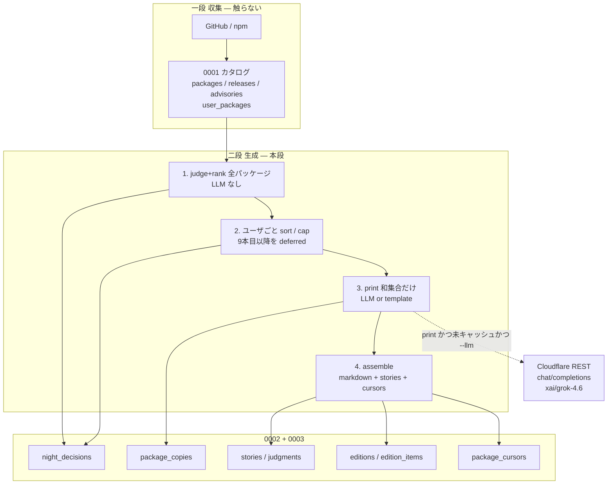

# 紙面生成（段階検証 2）

| 項目 | 値 |
| --- | --- |
| 文書 | chobitnews Paper Generation（段階検証 2） |
| 著者 | chobitnews |
| 日付 | 2026-09-21 |
| 状態 | Draft |
| 対象 | 収集済み共有カタログから、1 OSS 1 項の紙面を機械組版する。LLM は項の文章だけ |

この文書は `docs/収集.md` の兄弟であり、`docs/本番ワークフロー.md` の **「5. CopyFact → 号」**、**「二段: 収集と生成」の LLM 経路**、**PR 7**、および **表示上限 8 の並べ方（`publishedAt` 新しい順のみ）** を置き換える改正である。組版順は **rank desc → publishedAt desc**。Beat / ingest / email / GitHub App / OAuth は書き換えない。夜業の二段（収集は GitHub のみ → 生成は D1/sqlite の JSON のみ）、`generate_only` / `deliver_only` / `claim-run`、表示上限 8、lookback 21 日、human / silent / deferred、空号は成功、事実の発明禁止は維持する。既存の `docs/紙面生成.md`（SAMPLE_FACTS からのテンプレ検証）は履歴として残し、本段の正本はこちらである。実装時は `docs/本番ワークフロー.md` の表示上限節に「並べ方は紙面生成（段階検証 2）が上書き」と 1 行足してよい（Beat/ingest 本文は触らない）。

---

## Overview

段階検証 1 は、認可済みユーザと Beat を `fixtures/world.json` に固定し、OSS を共有カタログ（`packages` / `package_releases` / `package_advisories` / `user_packages`）へ機械収集するところまで通した。次に足りないのは、その保存済み JSON から朝刊の本文を書くことである。現行の `src/llm.ts` は `https://api.x.ai/v1/responses` に `grok-4.6` をハードコードし、`XAI_API_KEY` を要求する。`copy --llm` は `src/sample-facts.ts` を読むだけでカタログを見ない。本番の生成段としては使えない。

本段は **生成スパイク** である。ローカル sqlite と CLI / テストだけで、次を固定する。

1. LLM クライアントを **Cloudflare AI Gateway REST**（Chat Completions、カタログ model id）に差し替える。アプリに `XAI_API_KEY` を置かない。
2. 粒度は **1 OSS パッケージ → 1 コンテンツ（PackageCopy）**。号全体を LLM に渡さない。順位付け・紙面組版・masthead も LLM に渡さない。
3. 重要度は機械表。LLM の自由点は捨て、`kind` が `deriveKind` と一致しない出力はテンプレに倒す。
4. 生成は **judge+rank → ユーザごと cap → 残った print の和集合だけ LLM/template**。号の組版は今夜の `night_decisions` を読む（`package_copies` の履歴一覧ではない）。

品質の棒は手書き 1 号（`docs/紙面サンプル.md`）。受け入れは **4 print + 2 hold** と核キーワードであり、項順の完全一致は要求しない（組版は rank 順なので Hono が先頭になりうる）。

---

## Background & Motivation

### いまあるもの

| 層 | 実体 | 状態 |
| --- | --- | --- |
| 連続（drift） | `src/pipeline.ts` `runNight`、`src/schema.sql`、`test/continuity.test.ts` | 検証済み。本番の主経路ではない |
| テンプレ本文 | `src/copy.ts` `CopyFact` / `renderTemplateEdition` / `COPY_SYSTEM_PROMPT`、`test/copy.test.ts` | `pnpm verify:copy` が通る |
| 手書き 1 号 | `docs/紙面サンプル.md`、事実 JSON は `src/sample-facts.ts` | 4 print + 2 hold。コピー検証の `security:hono:4.13.7` は本番 id ではない |
| LLM スパイク | `src/llm.ts`、`tsx src/cli.ts copy --llm` | xAI Responses 直叩き。キー無しで未実行 |
| 収集 | `docs/収集.md`、`migrations/0001_catalog.sql`、`src/catalog/*`、`pnpm verify:ingest` | 共有カタログ済み。Story / Edition は 0001 に無い |
| 本番夜業 | `docs/本番ワークフロー.md` | 二段と hold 規則は正。生成の呼び出し方は本文書が上書きする |

収集の固定世界はユーザ `zaru`、Beat 10 リポ、deny 後 unique **約 37**。`fixtures/oss.json` の body は収集の結合確認用の短い固定値（例: wrangler は「Flagship をローカルで評価できる」1 行）であり、手書き 1 号の調査密度ではない。生成の品質ゲートは **別 fixture**（`fixtures/generate-night.json`）を使う。ingest 済み `data/catalog.sqlite` と混ぜない。

### 痛み

- `src/llm.ts` が provider-native の `/v1/responses` と model 文字列をコードに焼いている。カタログ入れ替えができない。
- `copy --llm` が `SAMPLE_FACTS` を 1 項ずつ markdown で書く。カタログも rank もユーザ組版も無い。
- 本番ワークフローの「5. CopyFact → 号」は、print 対象の生 JSON をまとめて grok に渡す書き方になっており、号全体の編集者 LLM に読める。1 OSS 1 項・機械 rank・共有コピーと衝突する。
- 本番ワークフローは「GHSA 同士は畳まない」と紙面 1 パッケージ 1 項が並立している。Hono（GHSA + 4.13.8）は 1 項だが、同一夜の第 2 GHSA の紙面表現が未決のまま残っている。

### 製品制約（動かさない）

- 入力は GitHub のみ。ローカルパス走査をしない。
- 号は毎日閉じてよい。地続きは Story。Investigation と Judgment を残す。
- LLM に GitHub / Web ツールを付けない。知識カットオフがあっても入力 JSON 以外の事実を足さない。
- 空の朝は成功。LLM を呼ばない。
- 事実にない数字を発明しない。
- パッケージマネージャは pnpm、Linter は Biome、コミットは日本語。

---

## Goals & Non-Goals

### Goals（この段階検証）

1. Cloudflare REST `POST /accounts/{account_id}/ai/v1/chat/completions` を唯一の LLM クライアントにする。model は `vars.LLM_MODEL`（既定 `xai/grok-4.6`）。呼び出し側に model 文字列を焼かない。
2. 課金は Gateway の **BYOK**（alias `default` に xAI キー）。アプリに `XAI_API_KEY` を置かない。v1 の Gateway 設定は **Require provider credentials = On**。
3. **cap 後の print 和集合**に限り、パッケージあたり高々 1 回 LLM を呼んで `PackageCopy`（headline / lead / sources / kind）を共有保存する。失敗・スキーマ違反・発明・kind 不一致はそのパッケージだけテンプレ。
4. rank は純関数。手書き 1 号相当の入力で 4 print + 2 hold になることをテストで固定する。
5. ユーザ号は今夜の `night_decisions`（`user_packages` で絞る）を **パッケージ単位** で rank desc → `publishedAt` desc、上限 **8 パッケージ**。残りは human / deferred / silent。組版は `renderTemplateEdition` 系。LLM なし。`resolve` は旧 Story の UPDATE。
6. CLI: `tsx src/cli.ts generate --date … --fixture …`（ネットワーク無し）と `generate --llm`（任意・REST）。`pnpm verify:copy` はテンプレのまま残す。`pnpm verify:generate` を足す。
7. スキーマ追加は `migrations/0002_copies.sql` と `migrations/0003_paper.sql`。0001 を膨らませない。適用済みファイルは編集しない。

### Non-Goals（この段階）

- Worker / Workflows / D1 本番接続 / Email / GitHub App / OAuth web flow。
- 号全体の LLM 編集、順位の LLM 出力、masthead の LLM。
- Workers AI `@cf/...` を本文の主経路にすること。
- provider-native `gateway.ai.cloudflare.com/.../grok`、および Cloudflare REST `/ai/v1/responses`。
- Unified Billing を v1 の既定支払いにすること。
- 世代割れ紙面、Issue 熱、停滞、近傍、使い方指摘。
- `test/copy.test.ts` を壊すこと（テンプレ経路は残す）。
- `src/sample-facts.ts` のコピー専用 Story id `security:hono:4.13.7` を本番 id に書き換えること（対応表は生成テスト側に書く）。
- hold 行の表示名マッピング（`TypeScript 7.0` など）。生成段の hold subject は npm 名。
- ユーザごとの GHSA seen-set。v1 の `stories` は共有（運営者 1 人）。

---

## Proposed Design

### 夜業の位置づけ

収集段は現状どおり。生成段だけを本文書が定義する。四段の順を崩さない。



### パイプライン（生成段）— 四段

号日は CLI の `--date`（`YYYY-MM-DD`）。lookback はその 21 日前（手書き 1 号なら 2026-08-31 以降が窓）。「今日」の暦日に依存させない。

永続する `visibility` は **`print` | `human` | `silent` | `deferred`** の 4 値だけ（本番ワークフローの Judgment 表と同じ `print`）。メモリ上の cap 前だけ `print_candidate` と呼ぶ。DB に `print_candidate` は書かない。

```
# 1. judge+rank（デスク全件。LLM なし。PackageCopy もまだ作らない）
for package in desk:          # スパイクの品質ゲートは fixture の packages[]
  raw = listReleases + listAdvisories
  window, latest, kind, rank, vis_mem = judgeAndRank(package, raw, cursors, lookback)
  # vis_mem ∈ { print_candidate, human, silent, skip }
  write night_decisions:
    silent → decision=hold, visibility=silent, rank=NULL, fingerprint=NULL
    human  → decision=hold, visibility=human, rank=10|20
    skip   → 行を書かない。stats.window_empty += 1
    print_candidate → まだ visibility を確定しない作業行（パッケージにつき GHSA 数だけ行がありうる）
                      （実装は vis=print 仮置きでもよいが、cap 後に同一パッケージを揃えて print|deferred へ更新）
    旧 held があり今夜 print/human が出る → 追加で decision=resolve, visibility=silent,
                      story_id=旧 id。cap 候補に入れない

# 2. ユーザごと cap（まだ LLM しない）。粒度はパッケージ。Story 行では数えない。
for user in users:
  pkgs = unique package_name where
         package ∈ user_packages
         AND そのパッケージに vis_mem == print_candidate の ND がある
         （decision=resolve の行は候補に入れない）
  各 pkg の sort キー = そのパッケージの print_candidate 行の max(rank), max(publishedAt)
  sort rank DESC, publishedAt DESC
  先頭 8 パッケージ → print 予定
  9 本目以降のパッケージ → そのパッケージの print_candidate ND を **全部**
                          visibility=deferred にする（同一夜の GHSA 2 行も揃えて deferred）。
                          Story も cursor も触らない。LLM しない
  print 予定パッケージの print_candidate ND も、cap の時点ではまだ vis 未確定でよい
  （確定は #3。実装はここで vis=print 仮置きしてもよいが、同一パッケージの全 print_candidate 行を同じ vis にする）

# 3. 生成（print 予定パッケージの和集合。v1 は |union| ≤ 8 パッケージ。複数ユーザなら 8 超ありうる）
to_generate = ∪ 各ユーザの print 予定パッケージ
for package in to_generate:
  fingerprint = sha256(canonical { t: sorted window tags, g: sorted window ghsa })
  if getPackageCopy(name, fingerprint): 再利用（LLM しない）
  else if --llm:
    REST 1 回。失敗 / スキーマ / 発明 / kind 不一致 → そのパッケージだけ templateCopy
  else:
    templateCopy
  persist package_copies
  そのパッケージの print_candidate ND を **全部**
    visibility=print, fingerprint=同じ値 に更新
    （Hono の GHSA 2 行は両方 print。片方だけ deferred にしない）
  decision=resolve の行は触らない（fingerprint は NULL のまま）

human / silent / deferred / skip / resolve には PackageCopy を作らない。

# 4. assemble（今夜の night_decisions が正本。先に decision を見る）
for user in users:
  rows = listNightDecisions(date) のうち package_name ∈ user_packages

  # 4a. resolve は紙面に出さない。旧 Story を UPDATE する（INSERT しない）
  for row where decision=resolve:
    UPDATE stories SET status='resolved', last_touched=date WHERE id=row.story_id
    INSERT investigation + judgment（decision=resolve）
    新 Story は作らない。edition_items にも載せない

  # 4b. 紙面はパッケージ 1 項。decision と vis の積
  print_pkgs = unique package_name where decision=print_new AND visibility=print
               （既に ≤8 パッケージ。Hono の GHSA 2 行は 1 パッケージ）
  human     = decision=hold AND visibility=human
  silent / deferred / resolve は紙面に出さない
  join package_copies on (package_name, fingerprint) で headline/lead
       （print_new 行だけ fingerprint がある）
  body = renderEditionFromCopies(date, print_pkgs, human)
  print_new+print と hold+human だけ stories へ INSERT（既存 id は触らない）
  editions / edition_items（PK は date+user+package_name。1 パッケージ 1 行）
  cursor: print パッケージは last_printed + last_seen、human は last_seen だけ
          deferred / resolve 専用行は cursor を触らない。GHSA 文字列は cursor に書かない
```

**LLM を呼ばない場合**

- silent / skip（窓が空、または latest 一致）。
- human hold。1 行で足りる。`package_copies` も作らない。
- deferred（9 パッケージ目以降）。**作らない理由はコストだけ。** fingerprint キャッシュは「同じ入力の再 LLM を省く」ものであり、assemble をスキップしない。先にコピーを作っても翌朝の judge は raw を見るので、deferred を隠すことにはならない。
- 空号（どのユーザの print も 0）。masthead と「新ニュースなし。」だけ。
- `--llm` 無し。
- 同じ fingerprint の `package_copies` が既にある。

定量（固定世界、v1 ユーザ `zaru` 1 人）:

| 集合 | 件数 | LLM |
| --- | --- | --- |
| deny 後デスク | ~37 | 0 |
| lookback 21 日に tag/GHSA があるもの | fixture 次第 | 0（judge のみ） |
| silent / skip / human / deferred | 大半 | 0 |
| print after cap | ≤ 8 **パッケージ** | ≤ 8（`--llm` 時） |
| 空号 | 0 print | 0 |
| 複数ユーザの和集合 | ≤ 8 × ユーザ数 | 8 を超えうる |

xAI 料金の既存見積を踏襲: 8 項 × 入出力 4k token でも 1 夜 $0.01 未満。壁時間の目標は 1 呼出 timeout **60 s**、8 直列でも **8 分以内**。スパイク CLI は直列。`max_tokens` と `temperature: 0` で reasoning の空振りを抑える。

### 1 OSS 1 項と Story の対応

紙面の項はパッケージにつき 1。連続の主語は従来どおり Story。

| 層 | 粒度 | 例（Hono、号日 2026-09-21） |
| --- | --- | --- |
| カタログ | パッケージ | `hono` |
| 生データ | tag / GHSA | `v4.13.7`, `v4.13.8`, `GHSA-hxh3-vqpv-xpqv` |
| PackageCopy | 1 夜 1 パッケージ（print だけ） | fingerprint = `{v4.13.7, v4.13.8, GHSA-hxh3-vqpv-xpqv}` のハッシュ |
| night_decisions | Story 行 | 主 `security:hono:GHSA-hxh3-vqpv-xpqv` visibility=print。同一夜の第 2 GHSA も別 Story 行（同じ fingerprint）。`release:hono:4.13.8` は紙面項を増やさない |
| edition_items | 1 パッケージ 1 行 | `story_id` = 主 Story（GHSA があればそれ。複数 GHSA なら `publishedAt` が新しい方） |
| package_cursors | semver のみ | `last_printed_version = 4.13.8`。GHSA は書かない |

**同一夜の複数 GHSA は紙面では畳む。** 本番ワークフローの「GHSA 同士は畳まない」は **Story 行** に残し、紙面項では覆す。lead / sources に両方の GHSA id と URL を列挙する。翌日 silent は `getStory("security:pkg:GHSA-…")` ごと。片方だけ既出なら、未見かつ lookback 内の GHSA だけが新データになり、その夜の PackageCopy は未見 GHSA（+ 窓内リリース）で 1 項。

Vitest 5.0 + 5.0.1、Zod 4.6.0 + 4.6.5 は既存の折り畳み（窓内最新 tag を主、他は points）。lookback 外の major は畳まない。

#### Story id の正本

形式は `release:{packageName}:{version}` / `security:{packageName}:{ghsa}`。`packageName` は npm 名そのもの（`@biomejs/biome`）。

パース: 接頭辞 `release:` または `security:` を除き、**最後の `:` で 1 回だけ**分割する。`split(":")` でフィールド数を数えない。

- コピー検証の `security:hono:4.13.7` / `hold:biome:2.5.14` は使わない。
- 生成の正本: `security:hono:GHSA-hxh3-vqpv-xpqv`、`release:@biomejs/biome:2.5.14`、`release:typescript:7.0.0`。

### Judge: 窓と silent

`src/catalog/store.ts` の `listReleases` / `listAdvisories` を読む。GitHub に戻らない。

**cursor 版の定義**

```
cursorVersion = semverMax(last_seen_version, last_printed_version)
欠ける側は −∞（比較に使わない）。human 直後は last_printed が NULL なので cursorVersion = last_seen。
```

窓（tag）:

- cursor 無し: `publishedAt >= lookbackStart`（号日 − 21 日、日付比較。時刻は UTC のまま切る）
- cursor 有り: 切った semver が `cursorVersion` **より新しい**（`>`。一致は窓に入れない）

窓（GHSA）— **lookback は cursor の有無にかかわらず常に効く**:

```
unseen = stories.id に `security:{pkg}:{ghsa}` が無い
window GHSA = unseen AND publishedAt >= lookbackStart
```

cursor があるからといって 2025 年の旧 advisory を print しない。v1 の `stories` は共有（運営者 1 人）。ユーザ別の seen-set は Non-Goal。

`publishedAt` 欠ける tag / GHSA は窓から落とす（stats `undated`）。号に出さない。

**silent:** 最新 tag の semver が `{ last_seen_version, last_printed_version }` のいずれかに一致し、かつ窓 GHSA が空。LLM も PackageCopy も作らない。`night_decisions` は 1 行書く（`visibility=silent`, `rank`/`fingerprint`/`copy_fact_json` は NULL）。`last_seen_on` だけ更新してよい。

**skip（窓空）:** 窓 tag も窓 GHSA も空で、silent でもない。

- latest が major かつ `publishedAt < lookbackStart`（TS 7）→ **human rank 10**（初見だけ。cursor が無いか、latest が cursor より新しいとき）
- それ以外（lookback 外の minor/patch、カタログに tag が無いデスク名）→ **skip**。PackageCopy なし、ND なし、LLM なし。stats `window_empty`

テスト必須（「print しない」が不変条件。silent と skip を混ぜない）:

- デスクに 60 日前の patch だけのパッケージ（cursor 無し）→ `skip` / `window_empty`
- cursor 無し + 2025 の GHSA だけ → `skip` / `window_empty`（lookback 外なので窓に入らない）
- **cursor 一致** + 2025 の GHSA → **`silent`**（窓 GHSA は空、ND 1 行、`last_seen_on` 更新、print しない）。`memVisibility === "skip"` を要求しない
- `last_printed=NULL` の human 翌日 → silent

### 機械 rank

`kind` は raw から先に決める。LLM が出す `kind` は **`=== expectedKind` の一致**であり、rank の入力に LLM の自由点を使わない。

```ts
export type CopyKind = "security" | "major" | "minor" | "patch" | "other";
/** DB に書く値。print_candidate はメモリ専用でここに含めない。 */
export type Visibility = "print" | "human" | "silent" | "deferred";
export type MemVisibility = "print_candidate" | "human" | "silent" | "skip";

export type RankInput = {
  packageName: string;
  windowReleases: { tagName: string; publishedAt: string; body: string | null }[];
  windowAdvisories: { ghsaId: string; publishedAt: string }[];
  latest: { tagName: string; publishedAt: string } | null;
  lookbackStart: string;
  editionDate: string;
  lastSeenVersion: string | null;
  lastPrintedVersion: string | null;
};

export type RankResult = {
  kind: CopyKind | null; // skip は null
  rank: number | null;
  memVisibility: MemVisibility;
  primaryTag: string | null;
  primaryPublishedAt: string | null;
  holdReason?: string;
};

export function deriveKind(input: RankInput): CopyKind | null { /* 純関数 */ }
export function rankFromRaw(input: RankInput): RankResult { /* 純関数 */ }
```

kind の決定順（窓が空なら呼ばない）:

1. プレリリース tag だけ（`1.0.0-rc.1` 等、semver の pre 部がある）→ **skip**（`other` にも `print_candidate` にもしない。stats `prerelease`）
2. `windowAdvisories.length > 0` → `security`
3. 窓内の **非プレリリース** tag を形で分類。いずれかが major → `major`（Vitest 5.0.1 が主でも 5.0.0 が窓にあれば major）
4. いずれかが minor → `minor`
5. いずれかが patch → `patch`
6. 分類不能の非プレリリース → v1 は **skip**（stats `unclassifiable`）。`other` は将来用で、print_candidate にしない

tag から semver を切る: `wrangler@4.135.0` / `v5.0.1` / `4.13.8`。外部 semver パッケージは足さない。比較は major.minor.patch の整数 3 つ。

**クラスは直前 tag との差（bump）ではなく、各 tag 自身の形:**

- `x.0.0`（または `x.0`）→ major
- `x.y.0`（`y > 0`）→ minor
- `x.y.z`（`z > 0`）→ patch

したがって **3.x → 4.135.0 は minor 60** であり major 80 ではない。窓が `2.0.1` だけの夜は patch-only human。この規則を「直す」と手書き 4+2 が壊れる。

Vitest `v5.0.0` は major、`v5.0.1` は patch、窓に両方 → kind=major。wrangler `4.135.0` は minor。Zod `4.6.0` は minor。Biome `2.5.14` は patch。TypeScript `7.0.0` は major。

rank 表（テスト可能な正本）。cap 前のメモリ vis と、cap 後に DB へ書く vis を分ける。

| 条件 | rank | メモリ vis | DB vis（cap 後） | 紙面 |
| --- | ---: | --- | --- | --- |
| 窓に GHSA | 100 | print_candidate | print（先頭 8 **パッケージ**）/ deferred（9+） | 項 or 非表示 |
| kind=major かつ主イベントが lookback 内 | 80 | print_candidate | 同上 | 同上 |
| kind=minor かつ主イベントが lookback 内 | 60 | print_candidate | 同上 | 同上 |
| kind=patch のみ（GHSA なし、major/minor なし） | 20 | **human** | human | 「今日書かないもの」。初見だけ |
| latest が major かつ publishedAt が lookback 外（TS 7） | 10 | **human** | human | 同上。LLM しない |
| 最新 semver ∈ {last_seen, last_printed} かつ窓 GHSA 空 | — | silent | silent | 出さない |
| 窓空、かつ lookback 外 major でもない | — | skip | 行なし | 出さない |
| プレリリースのみ / 分類不能 | — | skip | 行なし | 出さない |

パッチは本番ワークフローの「body 行数 ≥ 20」より一段きつく、**patch-only は本文の长短を問わず human** にする。根拠は `docs/紙面サンプル.md` の「今日書かないもの」（Biome 2.5.14）と上表。body 行数は `holdReason` 用（≥ 20 なら「パッチの羅列」、未満なら「パッチ」）。短文パッチを print する案は 1 号の棒に合わないので採らない。

主イベントの `publishedAt`（sort 第 2 キー）: 窓内で最も新しい `publishedAt`（GHSA と tag の max）。Hono は 4.13.8 の日が新しいならそちら。

human の翌日は silent。deferred は cursor を進めないので翌日また print_candidate。

**resolve:** 旧 `held` Story があり、今夜同じパッケージに新しい tag の print/human が出るとき、`night_decisions` に **別行** を足す（本番ワークフローどおり。紙面項は増やさない）。

| 列 | resolve 行 |
| --- | --- |
| `story_id` | **旧** held の id（新 version の id ではない） |
| `decision` | `resolve` |
| `visibility` | `silent`（紙面用 vis の再利用。assemble は **先に `decision` を見る**ので human/print にしない） |
| `rank` / `fingerprint` / `copy_fact_json` | NULL |
| cap | 候補に入れない |
| LLM / PackageCopy | 作らない |
| assemble | `UPDATE stories SET status='resolved'` + investigation/judgment。**新 Story は INSERT しない** |

新 version 側は通常の print_new または hold 行。本マイルストーンのテスト対象（「resolve 行がある」だけでは不足。旧 `stories.status` が `resolved` になること）。

#### 手書き 1 号に対する期待値

入力は `fixtures/generate-night.json`（`fixtures/oss.json` ではない）。号日 `2026-09-21`。hold の subject は **npm 名**（`typescript` / `@biomejs/biome`）。`test/copy.test.ts` の `TypeScript 7.0` / `Biome 2.5.14` は SAMPLE_FACTS 専用で、生成受け入れに使わない。

| パッケージ | kind | rank | DB vis | 主 Story id |
| --- | --- | ---: | --- | --- |
| hono（GHSA-hxh3-vqpv-xpqv + 4.13.8） | security | 100 | print | `security:hono:GHSA-hxh3-vqpv-xpqv` |
| vitest（5.0.0 + 5.0.1） | major | 80 | print | `release:vitest:5.0.1` |
| wrangler（4.135.0） | minor | 60 | print | `release:wrangler:4.135.0` |
| zod（4.6.0 + 4.6.5） | minor | 60 | print | `release:zod:4.6.5` |
| @biomejs/biome（2.5.14） | patch | 20 | human | `release:@biomejs/biome:2.5.14` |
| typescript（7.0.0、7 月） | major 窓外 | 10 | human | `release:typescript:7.0.0` |

print の表示順（rank desc、同 rank は publishedAt desc）: **Hono → Vitest → wrangler → Zod**。手書き 1 号は wrangler が先頭の編集順である。**受け入れは集合と核キーワードであり、項順の複製ではない。**

核キーワード（本文は完全一致しない）:

| 項 | いずれか |
| --- | --- |
| wrangler | Flagship |
| Vitest | 速さ / vmThreads / 0.74 |
| Zod | `.validate()` |
| Hono | `hono/jsx` / XSS / GHSA-hxh3 |
| TS hold | 今日の最新ではない |
| Biome hold | パッチ |

ゴールデン `fixtures/package-copies.template.json` の列: `package`, `kind`, `rank`, `visibility`, `story_id`、headline/lead が上の核キーワードを含むこと。

**連続（本マイルストーンのテスト）:**

- day-1 Hono print → `last_printed_version=4.13.8`（GHSA ではない）
- day-2 同じ raw → Hono は 0 LLM、0 print、0 human（silent）。Biome / TS も human の翌日 silent
- day-1 biome/TS human → `stories.status=held`。翌日新しい minor → ND は旧 id の `decision=resolve`（vis=`silent`）+ 新 id の print/human。旧 Story は `status=resolved`。hold 行から消える。同じ夜に再度 resolve しない

### LLM リクエスト / レスポンス

クライアントは `src/llm.ts` を置き換える。呼び出し側（`src/generate.ts`）は model 文字列を知らない。

```ts
export type LlmConfig = {
  accountId: string;
  apiToken: string;
  gatewayId: string; // 既定 "chobitnews"
  model: string;     // 既定 "xai/grok-4.6"
};

export type PackageLlmInput = {
  package: string;
  releases: {
    tag: string;
    publishedAt: string | null;
    htmlUrl: string | null;
    body: string | null;
  }[];
  advisories: {
    ghsa: string;
    publishedAt: string | null;
    summary: string | null;
    htmlUrl: string | null;
  }[];
};

export type PackageLlmOutput = {
  headline: string;
  lead: string;
  sources: string[];
  kind: CopyKind;
};

/** HTTP + JSON パースまで。kind 一致・発明検査は generate.ts。 */
export async function completePackageCopy(
  cfg: LlmConfig,
  input: PackageLlmInput,
  fetchImpl: typeof fetch = fetch,
  signal?: AbortSignal,
): Promise<PackageLlmOutput>;
```

エンドポイント（スパイク CLI も将来 Worker も同じ REST。`env.AI.run` にしない）:

```
POST https://api.cloudflare.com/client/v4/accounts/{account_id}/ai/v1/chat/completions
Authorization: Bearer {CLOUDFLARE_API_TOKEN}   # 権限: Workers AI Read のみ
Content-Type: application/json
cf-aig-gateway-id: chobitnews
cf-aig-request-timeout: 60000
```

クライアントは `AbortSignal` 60s を付ける（Gateway ヘッダと二重）。

ボディ:

```json
{
  "model": "xai/grok-4.6",
  "temperature": 0,
  "max_tokens": 800,
  "messages": [
    { "role": "system", "content": "…" },
    { "role": "user", "content": "{ package, releases, advisories }" }
  ],
  "response_format": {
    "type": "json_schema",
    "json_schema": {
      "name": "package_copy",
      "strict": true,
      "schema": {
        "type": "object",
        "additionalProperties": false,
        "required": ["headline", "lead", "sources", "kind"],
        "properties": {
          "headline": { "type": "string" },
          "lead": { "type": "string" },
          "sources": { "type": "array", "items": { "type": "string" } },
          "kind": {
            "type": "string",
            "enum": ["security", "major", "minor", "patch", "other"]
          }
        }
      }
    }
  }
}
```

`tools` は付けない。Web Search / GitHub を有効化しない。xAI `/v1/responses` も Cloudflare `/ai/v1/responses` も使わない。カタログ上の grok-4.6 の request format は Chat Completions（[xai/grok-4.6](https://developers.cloudflare.com/ai/models/xai/grok-4.6/)）。同ページは `response_format.type=json_schema` を載せる。既定は schema 付き。schema 系 4xx のときだけ 1 回外す。

**json_schema 耐性:** まず schema 付きで送る。再試行してよいのは **schema 関連の 4xx**（本文が schema / response_format エラー）だけ。**401 / 403 / 429 / 5xx は schema 無し再試行をしない**（最大 1 呼出でテンプレ）。再試行時は `choices[0].message.content` から JSON を切る（先頭 `{` 〜 末尾 `}`）。`reasoning_content` だけあって `content` が空ならテンプレ。パース失敗・空・必須欠落はそのパッケージのテンプレ。他パッケージは続ける。

システムプロンプト（`COPY_SYSTEM_PROMPT` は markdown 1 項用として残し、生成は別定数 `GENERATE_SYSTEM_PROMPT`）:

- 個人向け GitHub 朝刊の記者。
- 与えた JSON の事実だけ。日本語。
- 事実にない数字・機能・日付・URL を足さない。
- 手元の使用バージョン、リポジトリ間の世代割れ、ローカル配置に触れない。
- 見出しは「対象 版: 一点」。
- lead は 2〜5 文。出典は `sources` 配列（組版側が「出典:」を付ける）。
- `sources` は入力の `htmlUrl` の部分集合だけ。
- 入力に GHSA があるとき `kind` は必ず `security`。

ユーザペイロードは上の `PackageLlmInput` を `JSON.stringify`。窓内の tag / GHSA だけ。body は既に 8 KiB（`src/catalog/npm.ts` `truncateUtf8`）。

#### 破棄してテンプレにする条件

検査の所有: `completePackageCopy` は HTTP と JSON パースまで（PR 1）。`generate.ts` が URL・数字・kind 一致を見て fallback する（PR 3b）。

| 条件 | 誰 | 理由 |
| --- | --- | --- |
| HTTP 非 2xx（schema 再試行後も） | llm.ts | 障害 |
| 空の `choices[0].message.content` | llm.ts | 空本文 / reasoning のみ |
| JSON パース失敗 / 必須欠落 | llm.ts | スキーマ |
| `sources` に入力に無い URL | generate.ts | 発明（硬） |
| headline / lead の数字が **許可集合** に無い | generate.ts | 発明 |
| `output.kind !== expectedKind` | generate.ts | 不一致（ vitest の expected は `major`。`patch`/`minor`/`security` はテンプレ） |

**許可数字集合**（入力 JSON の生部分文字列だけではない）:

1. 入力 JSON に現れる連続数字・semver・GHSA 内 hex
2. 各 `publishedAt` から導く `YYYY-MM-DD`、UTC と JST の `M月D日`、その `M` と `D`（ゼロ埋め無し。`src/copy.ts` の `dateJa` と同じ）
3. 切った semver の major / minor / patch 部分（`4.135.0` から `4.135` と `4` と `135` と `0`）
4. 入力 body に既にある数字（`0.74`、`1.59s` 等）

未知 URL は許可しない。`9月3日` を含む合法 lead の fixture は **fallback してはならない**。散文の助数（「2文」）は許可集合に無ければ fallback。プロンプトは助数を書かせない。

テンプレ `PackageCopy` は heuristic CopyFact → `templateHeadline` / `templateLead`。`kind` は `deriveKind`。`body_source = "template"`。

統計: `llm_ok`, `llm_fallback`, `llm_skipped_silent`, `llm_skipped_human`, `llm_skipped_deferred`, `window_empty`, `copies_written`。`--llm` 時は応答の `gatewayMetadata.keySource`（BYOK vs Unified）を stats に残す（ダッシュボード無しで Require On を確認する）。

### 認証・支払い・Gateway

AI Gateway は推論エンジンではない。ログ・キャッシュ・レート制限のプロキシである。Workers AI `@cf/...` は主経路にしない。

トークンは **2 枚に分ける**:

| 用途 | 権限 | 置き場 |
| --- | --- | --- |
| (a) ゲートウェイ作成・BYOK・Require On | **AI Gateway Edit** | ダッシュボード操作。アプリに入れない |
| (b) 推論 REST | **Workers AI Read のみ** | CLI の `CLOUDFLARE_API_TOKEN`。AI Gateway 権限を付けると REST が 401 になる |

| 項目 | v1 |
| --- | --- |
| 入口 | REST `api.cloudflare.com` `/ai/v1/chat/completions` |
| 認証 | (b) を `Authorization` |
| ルーティング | `cf-aig-gateway-id: chobitnews`（`default` ゲートウェイにしない） |
| 支払 | **BYOK**。Provider Keys に xAI キーを **alias `default`** |
| Require provider credentials | **On**（`byok_only: true`） |
| アプリの秘密 | `CLOUDFLARE_ACCOUNT_ID` / (b)。**`XAI_API_KEY` は置かない** |
| model | `LLM_MODEL` 既定 `xai/grok-4.6` |

資格情報の解決順:

1. リクエスト上の provider キー（REST の `Authorization` は Cloudflare トークンなので、ここには xAI キーを載せない）
2. ゲートウェイに保存した BYOK の **`default` alias**
3. Unified Billing（credit 購入時およそ +5%）

REST は **default alias しか見ない**。xAI キーは必ず `default` に置く。

Require provider credentials:

- **On（v1 既定）:** BYOK が無ければ 400。Unified に落ちない。
- **Off:** 他カタログモデルをキー無しで試せるが、default BYOK が無いとその分 Unified になる。

モデル差し替えは `LLM_MODEL` の文字列変更。差し替え時にそのプロバイダのキーを `default` へ入れる。1 alias 1 キー。同時に複数プロバイダの BYOK を REST で使い分けない。

キャッシュ: 同じ JSON の再生成で効きうる。正本は fingerprint 再利用。

### ユーザ組版

`src/copy.ts` の `renderTemplateEdition` は SAMPLE_FACTS 経路用に残す。生成段:

```ts
export function renderEditionFromCopies(
  date: string,
  printed: { storyId: string; headline: string; lead: string; bodySource: "llm" | "template"; sources: string[] }[],
  holds: { subject: string; holdReason: string }[],
): Edition {
  // printed は既に sort / cap 済み
  // 0 件なら「新ニュースなし。」
  // holds の subject は npm 名
}
```

入力は `listNightDecisions(date)` + `getPackageCopy(name, fingerprint)`。`listPackageCopiesByPackages` は作らない（履歴コピーが今夜に混ざる）。

`body_source === "llm"` のときだけ組版側で `出典:` 行を足す。テンプレの `templateLead` は既に出典を含む。

複数ユーザ: PackageCopy は print 和集合で 1 回。スパイクの正本ユーザは `zaru`。alice テストは同じ wrangler の **同じ fingerprint** が両方の号に載ること（コピー行は 1）。

### テンプレ heuristic（`--llm` 無し・失敗時）

本番ワークフローの CopyFact 切りを `src/copy.ts` 近傍に関数化（収集段では切らない）:

- `occurredOn` = 主イベントの `publishedAt` 日付（JST にずらさない）
- `versionLabel` = 主 tag から `v` / `pkg@` を除去
- `thesis` = 主 release name、空なら body 先頭の非空行 40 字。GHSA なら summary
- `points` = 見出し / 箇条書き + 畳み行、最大 8
- 事実にない数字を足さない

`pnpm verify:copy` はこの heuristic を通らない（SAMPLE_FACTS 直入力）。壊さない。

### スパイクのコマンドと fixture

```sh
pnpm verify                 # vitest run。rank / generate テストを含む。ネットワーク無し。--llm は入れない
pnpm verify:copy            # 既存。SAMPLE_FACTS → テンプレ号
pnpm verify:generate        # CLI。下の --fixture 既定で 4+2 を stdout
tsx src/cli.ts generate --date 2026-09-21 --fixture fixtures/generate-night.json
tsx src/cli.ts generate --date 2026-09-21 --catalog data/catalog.sqlite
tsx src/cli.ts generate --date 2026-09-21 --fixture fixtures/generate-night.json --llm
```

| フラグ | 意味 |
| --- | --- |
| `--date` | 号日。必須（品質ゲートは `2026-09-21`）。「今日」にしない |
| `--fixture PATH` | `generate-night.json` を空 DB に seed してから生成。ingest sqlite を見ない |
| `--catalog PATH` | 既存カタログを読む。品質ゲートではない |
| `--user` | 既定 `zaru` |
| `--llm` | REST を使う。これがあるときだけ LLM。`LLM_GENERATE=1` を含意する。無いときはテンプレ |
| `--llm` かつ Cloudflare 環境変数欠落 | 非 0。黙ってテンプレにしない |

`--fixture` と `--catalog` は排他。両方無しはエラー。`pnpm verify:ingest` 済みの `data/catalog.sqlite` を `verify:generate` が黙って使わない。

環境変数（`--llm` 時）:

| 変数 | 既定 | 意味 |
| --- | --- | --- |
| `LLM_MODEL` | `xai/grok-4.6` | カタログ id |
| `LLM_GATEWAY_ID` | `chobitnews` | `cf-aig-gateway-id` |
| `CLOUDFLARE_ACCOUNT_ID` | 必須 | REST パス |
| `CLOUDFLARE_API_TOKEN` | 必須 | Workers AI Read（推論用） |

`LLM_GENERATE` は Worker 後続の `vars` 用。スパイク CLI のスイッチは `--llm` だけ。`LLM_GENERATE=1` だけで `--llm` 無しは REST しない。

`tsx src/cli.ts copy --llm` はデバッグ用に残してよい（SAMPLE_FACTS → 新クライアント）。品質ゲートは `verify:generate`。

#### `fixtures/generate-night.json` の形

0003 の FK（`package_copies.package_name` → `packages`、`editions.user_id` → `users`）を満たすため、親を含む。

```json
{
  "edition_date": "2026-09-21",
  "users": [
    {
      "id": "zaru",
      "github_login": "zaru",
      "github_id": "235650",
      "packages": ["hono", "vitest", "wrangler", "zod", "@biomejs/biome", "typescript"]
    }
  ],
  "packages": [
    { "name": "hono", "ecosystem": "npm", "github_repo": "honojs/hono" }
  ],
  "releases": [
    {
      "package_name": "hono",
      "tag_name": "v4.13.8",
      "published_at": "2026-09-15T00:00:00.000Z",
      "html_url": "https://github.com/honojs/hono/releases/tag/v4.13.8",
      "body": "…"
    }
  ],
  "advisories": [
    {
      "package_name": "hono",
      "ghsa_id": "GHSA-hxh3-vqpv-xpqv",
      "published_at": "2026-09-04T00:00:00.000Z",
      "summary": "hono/jsx の XSS",
      "html_url": "https://github.com/advisories/GHSA-hxh3-vqpv-xpqv"
    }
  ]
}
```

日付は紙面サンプルに合わせる（Vitest 9/3 と 9/15、Hono GHSA 9/4、TS 7 月、Biome 9/16）。body は核キーワードが切れる密度。`loadGenerateNight(store)` は **users / packages → user_packages → releases / advisories** の順に upsert する。`fixtures/oss.json`（repo キー）とは別形。

`openCatalogDb` は未適用ファイルだけ流す。0002 適用済み DB に 0002 を足さない。0003 は別ファイルなので reopen で足る。

---

## API / Interface Changes

公開 API は無い。内部の差し替えだけ。

### Before: `src/llm.ts`

```ts
const API_URL = "https://api.x.ai/v1/responses";
const MODEL = "grok-4.6";
export async function generateItemWithLlm(date: string, fact: CopyFact, apiKey: string): Promise<string>
export function readXaiApiKey(): string | undefined
```

### After

```ts
export function readLlmConfig(env: Record<string, string | undefined>): LlmConfig | null
export async function completePackageCopy(
  cfg: LlmConfig,
  input: PackageLlmInput,
  fetchImpl?: typeof fetch,
  signal?: AbortSignal,
): Promise<PackageLlmOutput>
```

`readXaiApiKey` は削除。テストは `fetchImpl` を差し込む。

### CatalogStore 拡張

```ts
upsertPackageCopy(row: PackageCopyRow): Promise<void>
getPackageCopy(packageName: string, fingerprint: string): Promise<PackageCopyRow | undefined>
listNightDecisions(date: string): Promise<NightDecisionRow[]>
upsertNightDecision(row: NightDecisionRow): Promise<void>
getCursor(packageName: string): Promise<PackageCursor | undefined>
upsertCursor(row: PackageCursor): Promise<void>
// 0003: stories / editions / edition_items も同じ store。src/db.ts とは混ぜない。
// listPackageCopiesByPackages は作らない。
```

### CLI

`src/cli.ts` に `generate`。フラグは上表。`--llm` かつ設定欠落は非 0。

---

## Data Model Changes

適用済み migration は編集しない（`openCatalogDb` はファイル名を `schema_migrations` に 1 度だけ記録する）。

**PR 2: `migrations/0002_copies.sql`** — copies / cursors / night_decisions だけ。

**PR 3a: `migrations/0003_paper.sql`** — stories / investigations / judgments / editions / edition_items。

0001 に ALTER で Story を足さない。D1 本番でも同じファイルを後で apply する。

```sql
-- 0002_copies.sql
CREATE TABLE package_copies (
  package_name TEXT NOT NULL,
  fingerprint TEXT NOT NULL,
  headline TEXT NOT NULL,
  lead TEXT NOT NULL,
  sources_json TEXT NOT NULL,
  kind TEXT NOT NULL,             -- security|major|minor|patch|other
  body_source TEXT NOT NULL,      -- llm|template
  model TEXT,
  created_at TEXT NOT NULL,
  PRIMARY KEY (package_name, fingerprint),
  FOREIGN KEY (package_name) REFERENCES packages(name) ON DELETE CASCADE
);

CREATE TABLE package_cursors (
  package_name TEXT PRIMARY KEY,
  last_seen_version TEXT,
  last_seen_published_at TEXT,
  last_seen_on TEXT,
  last_printed_version TEXT,
  last_printed_on TEXT,
  prev_seen_version TEXT,
  prev_seen_published_at TEXT,
  prev_seen_on TEXT,
  prev_printed_version TEXT,
  prev_printed_on TEXT,
  FOREIGN KEY (package_name) REFERENCES packages(name) ON DELETE CASCADE
);

CREATE TABLE night_decisions (
  date TEXT NOT NULL,
  story_id TEXT NOT NULL,
  package_name TEXT NOT NULL,
  decision TEXT NOT NULL,         -- print_new | hold | resolve
  visibility TEXT NOT NULL,       -- print | human | silent | deferred
                                  -- resolve 行は decision=resolve かつ visibility=silent
  rank INTEGER,                   -- silent は NULL
  fingerprint TEXT,               -- print のみ。human/silent/deferred は NULL
  copy_fact_json TEXT,            -- デバッグ用。silent は NULL 可
  reason TEXT,
  PRIMARY KEY (date, story_id)
);

CREATE INDEX idx_night_decisions_pkg ON night_decisions(date, package_name);
CREATE INDEX idx_package_copies_created ON package_copies(created_at);
```

```sql
-- 0003_paper.sql
CREATE TABLE stories (
  id TEXT PRIMARY KEY,
  kind TEXT NOT NULL,
  subject TEXT NOT NULL,
  thesis TEXT NOT NULL,
  status TEXT NOT NULL,           -- printed | held | resolved | dropped
  flip_condition TEXT NOT NULL,
  opened_on TEXT NOT NULL,
  last_touched TEXT NOT NULL
);

CREATE TABLE investigations (
  id INTEGER PRIMARY KEY,
  date TEXT NOT NULL,
  story_id TEXT NOT NULL,
  facts_json TEXT NOT NULL,
  FOREIGN KEY (story_id) REFERENCES stories(id)
);

CREATE TABLE judgments (
  id INTEGER PRIMARY KEY,
  date TEXT NOT NULL,
  story_id TEXT NOT NULL,
  investigation_id INTEGER NOT NULL,
  decision TEXT NOT NULL,
  reasons_json TEXT NOT NULL,
  FOREIGN KEY (story_id) REFERENCES stories(id),
  FOREIGN KEY (investigation_id) REFERENCES investigations(id)
);

CREATE TABLE editions (
  date TEXT NOT NULL,
  user_id TEXT NOT NULL,
  body TEXT NOT NULL,
  item_count INTEGER NOT NULL DEFAULT 0,
  hold_count INTEGER NOT NULL DEFAULT 0,
  status TEXT NOT NULL DEFAULT 'composed',
  PRIMARY KEY (date, user_id),
  FOREIGN KEY (user_id) REFERENCES users(id) ON DELETE CASCADE
);

CREATE TABLE edition_items (
  date TEXT NOT NULL,
  user_id TEXT NOT NULL,
  package_name TEXT NOT NULL,
  story_id TEXT NOT NULL,
  rank INTEGER NOT NULL,
  headline TEXT NOT NULL,
  lead TEXT NOT NULL,
  PRIMARY KEY (date, user_id, package_name),
  FOREIGN KEY (date, user_id) REFERENCES editions(date, user_id) ON DELETE CASCADE,
  FOREIGN KEY (story_id) REFERENCES stories(id)
);
```

スパイクの `src/schema.sql`（drift 連続）は残す。0003 の `stories` と形は近いが DB を共有しない。

**rank の保存場所:** `package_copies` には rank を持たせない。今夜の値は `night_decisions.rank` と `edition_items.rank`。

fingerprint: SHA-256 hex。canonical JSON `{"t":["...sorted tags"],"g":["...sorted ghsa"]}`。body は含めない。

容量: コピー 1 件 2–5 KB。`pipeline_runs` は本段に入れない。

resetNight（2 日連続テスト用）: `edition_items` → `editions` → `judgments` → `investigations` → その日 `opened_on` の `stories` → `night_decisions`。cursor の `last_*_on = date` を `prev_*` に戻す。所有は PR 3a の連続テスト。

### 移行

本番前。オンライン移行なし。既存 `data/catalog.sqlite` は reopen で 0002 未適用なら 0002、続けて 0003。適用済み 0002 を編集しない。

---

## Alternatives Considered

### 1. 号全体 LLM vs 1 OSS 1 LLM

| | 号全体 | 1 OSS（採用） |
| --- | --- | --- |
| 失敗 | 号ごとテンプレ | パッケージだけテンプレ |
| 発明の範囲 | 項を増やす・順位をいじる余地 | 1 項の文章に閉じる |
| 共有 | ユーザ人数倍 | パッケージ 1 回 |
| 空号 | モデルが masthead を書きがち | 呼ばない |

採用: 1 OSS。号の編集者 LLM は「興味の本体は Investigation と Judgment」と逆行する。

### 2. provider-native grok vs Cloudflare REST Chat Completions vs REST Responses

| | `…/grok` native | REST `/ai/v1/chat/completions`（採用） | REST `/ai/v1/responses` |
| --- | --- | --- | --- |
| 認証 | xAI キー or `cf-aig-authorization` | Cloudflare トークン + Workers AI Read | 同左 |
| model id | `grok-4.6` | `xai/grok-4.6` | カタログは Chat Completions |
| 差し替え | URL が grok 固定 | 文字列だけ | Responses 前提のモデル向け |
| BYOK | default 以外も alias 可 | **default のみ** | default のみ |

採用: REST Chat Completions。`/ai/v1/responses` は grok-4.6 カタログの request format が Chat Completions のため使わない（現行 `src/llm.ts` の Responses を Cloudflare URL に移植しない）。

### 3. LLM の重要度点 vs 機械 rank

| | 自由点 7/10 | 機械表（採用） |
| --- | --- | --- |
| 再現 | 低い | テスト可能 |
| 手書き 1 号 | モデル任せ | 4+2 を固定 |
| GHSA の扱い | 忘れることがある | kind 不一致で破棄 |

LLM の `kind` は `=== expectedKind` だけ。

### 4. デスク全件生成 vs 新データだけ vs cap 後の print 和集合

| | 全デスク ~37 | 新データのみ | cap 後の print 和集合（採用） |
| --- | --- | --- | --- |
| LLM 回数 | 37 | 十数（初号） | v1 は ≤ 8。複数ユーザの和は 8 超 |
| deferred | 先にコピーしてコストだけ無駄 | 同じ | 作らない（コスト） |
| silent | 無駄 | 除外できる | 除外 |

四段の 2 のあとで 3 を呼ぶ。cap 前に REST しない。

### 5. Unified Billing vs BYOK

資格・支払いのモード差。v1 は BYOK + Require On。Unified は試すときだけ Require Off。

### 6. 短文パッチを print する（却下）

本番ワークフローは「patch かつ body ≥ 20 行」だけ human。短文パッチを rank 40 print にすると 1 号にパッチ項が混ざりうる。`docs/紙面サンプル.md` の「今日書かないもの」と本 rank 表に合わせ、patch-only は rank 20 human。

---

## Security & Privacy Considerations

| 脅威 | 深刻度 | 緩和 |
| --- | --- | --- |
| LLM が事実・URL・数字を発明する | High | 入力 JSON のみ。ツール無し。URL 部分集合。導出数字の許可集合。kind `===`。パッケージ単位テンプレ |
| Unified Billing への意図しない落下 | Medium | BYOK default + Require On。stats の `keySource` |
| Cloudflare API トークン漏洩 | Medium | 推論トークンは Workers AI Read のみ。作成用 Edit はダッシュボード。`XAI_API_KEY` はアプリに置かない |
| プロンプト経由の依存名・ GHSA 本文 | Low | 単一運営者。Gateway ログに残る前提。private advisory は収集していない |
| モデル差し替えで別プロバイダへ本文が渡る | Low | `LLM_MODEL` は運用イベント。On ならキー無しは失敗 |

LLM に GitHub トークンも `package.json` 全文も渡さない。

---

## Observability

スパイク: CLI が 1 行 JSON。

```json
{"msg":"generate.done","date":"2026-09-21","user":"zaru","print":4,"human":2,"silent":0,"deferred":0,"window_empty":0,"llm_ok":3,"llm_fallback":1,"keySource":"BYOK","ms":12345}
```

token・release body 全文は出さない。`--llm` 失敗はパッケージ名と HTTP status だけ。

後続の Workflow では `pipeline_runs.stats_json` に `llm_ok` / `llm_fallback` を足す。xAI 失敗はアラートしない。空号もアラートしない。

---

## Rollout Plan

本段は検証スパイク。CLI の LLM スイッチは `--llm`。後続 Worker は `vars.LLM_GENERATE`。

1. PR 群をローカルでマージ。`pnpm verify`（vitest）が緑。
2. `pnpm verify:generate` が手書き 1 号の 4+2 を固定。
3. **ダッシュボード**（AI Gateway Edit）: ゲートウェイ `chobitnews` を作り、xAI キーを BYOK `default`、Require On。
4. **別トークン**（Workers AI Read のみ）を CLI に渡す。
5. 任意: `tsx src/cli.ts generate --date 2026-09-21 --fixture fixtures/generate-night.json --llm` を目視。`keySource=BYOK`。失敗してもテンプレ号。
6. マイルストーン A は **メールしない**。品質が通るまで Worker の generate step に載せない。
7. 後続: NightlyEdition の generate をこの四段に置換。`vars.LLM_GENERATE` / `vars.LLM_MODEL`。`XAI_API_KEY` は required に入れない。

Rollback: `--llm` を外す / `LLM_GENERATE=0`。Gateway 障害はパッケージ単位 fallback。収集段は巻き戻さない。

---

## Open Questions

ユーザが閉じたもの（REST vs native、1 OSS 1 項、機械 rank、BYOK）は再開しない。

1. ~~grok-4.6 の json_schema~~ **閉じた。** カタログは `response_format.type=json_schema` を載せる。schema 系 4xx の 1 回外しはベルトとして残す。
2. **`LLM_MODEL` の既定文字列**は `xai/grok-4.6`。カタログ改名があれば vars だけ変える。
3. **Require provider credentials** の既定は On。他社モデルをキー無しで試すときだけ Off。

送信ドメインと Desk の deny/allow は本番ワークフローの Open Questions のまま。本段の対象外。

---

## Key Decisions

1. **LLM クライアントは Cloudflare AI Gateway REST（Chat Completions）。** provider-native grok URL、xAI `/v1/responses`、Cloudflare `/ai/v1/responses` は捨てる。カタログ id（既定 `xai/grok-4.6`）を `LLM_MODEL` から読む。Workers AI `@cf/...` は主経路にしない。
2. **支払は BYOK（alias `default`）+ Require provider credentials On。** 推論トークンは Workers AI Read のみ。ゲートウェイ作成は AI Gateway Edit の別トークン。アプリに `XAI_API_KEY` を置かない。
3. **生成粒度は 1 OSS → 1 PackageCopy。** 号全体 LLM、第二 LLM はしない。masthead と空号はテンプレ。
4. **kind / rank は raw の純関数。** LLM の `kind` は `=== expectedKind`。不一致・発明はパッケージ単位でテンプレ。検査は `generate.ts`。
5. **四段: judge+rank → ユーザ cap → print 和集合だけ LLM → assemble。** cap は **パッケージ 8**（Story 行ではない）。同一パッケージの ND は print/deferred を揃える。silent / human / deferred / skip / resolve / 空号は LLM しない。v1 は ≤8 呼出。複数ユーザの和は 8 を超えうる。deferred を先に作らない理由はコスト。
6. **紙面は 1 パッケージ 1 項。複数 GHSA も畳む。** Story 行は GHSA ごと（両方 `print`、同じ fingerprint）。cursor は semver のみ。
7. **組版の正本は今夜の `night_decisions`。先に `decision` を見る。** `package_copies` のパッケージ名一覧ではない。sort は rank desc → publishedAt desc。上限 8 パッケージ。紙面は `print_new`+`print` と `hold`+`human` だけ。`decision=resolve` は旧 Story を `resolved` に UPDATE し、項にも hold 行にもしない。deferred は非表示・cursor 非更新。
8. **patch-only は rank 20 human（初見のみ）。** 古い lookback 外 major は rank 10 human。窓空の minor/patch は skip。手書き 1 号の 4 print + 2 hold を受け入れ。項順の複製は要求しない。hold subject は npm 名。
9. **スキーマは 0002_copies + 0003_paper。** 適用済みファイルは編集しない。`package_copies` に rank を恒久保存しない。human には PackageCopy を作らない。silent ND は書き、`copy_fact_json` は NULL 可。
10. **この段階はローカル sqlite + CLI + テスト。** Worker / メール / GitHub App は載せない。`pnpm verify` = vitest。`pnpm verify:generate` = CLI fixture。`--llm` は verify に入れない。
11. **品質 fixture は `generate-night.json`（親 users/packages 付き）。** ingest sqlite と黙って混ぜない。`--date` / `--fixture` / `--catalog` を明示する。
12. **json_schema を優先し、schema 系 4xx だけ 1 回外す。** 401/403/429/5xx は外さない。カタログは schema 対応。`max_tokens` と `temperature: 0`、timeout 60s。
13. **semver クラスは bump ではなく tag の形。** `x.y.0` は minor。3.x → 4.135.0 は rank 60。窓が `2.0.1` だけなら patch human。
14. **Story id は npm 名をそのまま埋め、最後の `:` でパースする。** `@biomejs/biome` を `biome` に縮めない。
15. **GHSA の lookback は cursor があっても効く。** unseen = `stories` 未登録 **かつ** `publishedAt >= lookback`。v1 の stories は共有。
16. **`--llm` があるときだけ REST。** 環境変数 `LLM_GENERATE` だけでは CLI は叩かない。
17. **`resolve` は旧 held の UPDATE。** ND は旧 `story_id` + `decision=resolve` + `visibility=silent`。新 Story を INSERT しない。翌朝「旧 held があり」で resolve を再発行しない。

---

## Risks

| ID | リスク | 深刻度 | 緩和 |
| --- | --- | --- | --- |
| G1 | schema 系 4xx で 2 呼出 | Low | カタログは対応。401 等は再試行しない |
| G2 | 数字検査の残誤検知 | Low | 導出日付・semver 部分を許可。`9月3日` fixture が fallback しないこと |
| G3 | BYOK 未設定で 400 | Medium | Require On 明示。`keySource`。号はテンプレ |
| G4 | fingerprint が body を見ない | Low | v1 受容 |
| G5 | 手書きの blog URL がカタログに無い | Low | sources に出さない。核キーワード |
| G6 | rank 順で Hono が先頭 | Low | 仕様。受け入れに項順を入れない |
| G7 | 初号で minor が deferred | Medium | cap。翌日再評価。human に混ぜない |
| G8 | 並列で Gateway レート | Low | スパイクは直列 |
| G9 | grok が `reasoning_content` だけ返す | Medium | `content` 空はテンプレ。`max_tokens` / `temperature: 0` |
| G10 | 適用済み 0002 を編集して schema が欠ける | High | 0003 を別ファイル |

---

## References

製品:

- `docs/検証結果.md` — 再開の正本。次検証が本段
- `docs/収集.md` — 段階検証 1。共有カタログ。`openCatalogDb` はファイルを 1 度だけ適用
- `docs/本番ワークフロー.md` — 夜業・hold・cursor。本文書が生成経路と表示順を上書き
- `docs/紙面サンプル.md` / `docs/紙面生成.md` — 品質棒とテンプレ検証
- `migrations/0001_catalog.sql`、`src/catalog/store.ts`、`src/catalog/ingest.ts`、`src/catalog/npm.ts`（8 KiB）
- `src/copy.ts`（`dateJa`）、`src/llm.ts`、`src/cli.ts`、`src/sample-facts.ts`
- `test/copy.test.ts`、`test/catalog.test.ts`
- `fixtures/world.json`、`fixtures/oss.json`

Cloudflare:

- https://developers.cloudflare.com/ai/models/xai/grok-4.6/ — カタログ id、Chat Completions、json_schema
- https://developers.cloudflare.com/ai-gateway/usage/rest-api/ — 推論は Workers AI Read。`cf-aig-request-timeout`
- https://developers.cloudflare.com/changelog/post/2026-05-21-rest-api/ — REST `/ai/v1/chat/completions`
- https://developers.cloudflare.com/ai-gateway/features/unified-billing/ — 資格の順、default alias
- https://developers.cloudflare.com/changelog/post/2026-09-14-require-provider-credentials/ — `byok_only`
- https://developers.cloudflare.com/ai-gateway/configuration/bring-your-own-keys/
- https://developers.cloudflare.com/ai-gateway/usage/providers/grok/ — provider-native（本段は使わない）
- https://developers.cloudflare.com/ai-gateway/get-started/ — ゲートウェイ作成は AI Gateway Edit

---

## PR Plan

本マイルストーンはカタログ + copy の上に載せる。Worker / メール / GitHub App / OAuth は含めない。PR 1 と PR 2 は並列。適用済み SQL ファイルは後続 PR で編集しない。

### PR 1 — Cloudflare REST クライアント

- **タイトル:** LLM クライアントを Cloudflare Chat Completions に差し替える
- **対象:** `src/llm.ts`、`src/cli.ts` の `copy --llm`、`test/llm.test.ts`
- **依存:** なし
- **内容:** `api.x.ai` / `XAI_API_KEY` / ハードコード model / Responses を削除。`completePackageCopy` はパース済み JSON のみ返す（kind 一致は見ない）。schema 付き → schema 系 4xx のみ 1 回外す。401/403/429 は外さない。`temperature: 0`、`max_tokens: 800`、`cf-aig-request-timeout`、AbortSignal 60s。空 `content` は throw。ネットワーク無しテスト。

### PR 2 — 機械 rank と 0002

- **タイトル:** rank 表を手書き 1 号と skip 規則で固定する
- **対象:** `migrations/0002_copies.sql`、`src/rank.ts`、`src/catalog/store.ts` の copy/cursor/ND メソッド、`src/catalog/types.ts`、`fixtures/generate-night.json` の最小（親 + 6 本）、`test/rank.test.ts`
- **依存:** なし（0001 の上）。PR 1 と独立
- **内容:** `deriveKind` / `rankFromRaw`。4 print_candidate + 2 human。Vitest は major 80。patch-only 20。TS 7 は 10。60 日前 patch（cursor 無し）は skip。cursor 無し + 2025 GHSA だけは skip。**cursor 一致 + 2025 GHSA は silent**（print しない。skip ではない）。`last_printed=NULL` で silent。3.x→4.135.0 は minor。Story id パーサ（最後の `:`）。semver 切り出し。0001 を変更しない。**0002 に stories/editions を書かない。**

### PR 3a — 0003 とテンプレ組版・連続

- **タイトル:** night_decisions から号を組み、day-2 silent を固定する
- **対象:** `migrations/0003_paper.sql`、`src/assemble.ts`、`src/generate.ts` のテンプレ経路（heuristic、fingerprint、cap）、`src/copy.ts` の出典ヘルパ（既存 `renderTemplateEdition` は壊さない）、`loadGenerateNight`、`test/generate.test.ts`、ゴールデン
- **依存:** PR 2。PR 1 不要（`--llm` 無し）
- **内容:** fixture で 4 print + 2 human（npm 名）。核キーワード。cap はパッケージ 8。print 候補 9 パッケージ → 8 print + 1 deferred（Story/cursor 無し）。**print 8 パッケージ + Hono GHSA 2 行 → 項は 9 にならず、Hono は 1 項、両 Story 行は `print`（同じ fingerprint）。片方 deferred にしない。** 同一夜 2 GHSA → 1 項 + Story 2 行。day-1 Hono → cursor `4.13.8` → day-2 silent。Biome/TS の day-2 silent。day-1 biome/TS `status=held` → 新 minor で ND `decision=resolve`（旧 id、vis=silent）+ 新 print/human、旧 Story は `resolved`、hold 行から消える。`test/copy.test.ts` は緑。assemble は `decision` を先に見る。human に PackageCopy を書かない。

### PR 3b — LLM fallback と発明検査

- **タイトル:** print 和集合だけ REST し、kind 不一致と発明をテンプレに倒す
- **対象:** `src/generate.ts` の LLM 分岐、許可数字集合、`test/generate.test.ts` の mock fetch
- **依存:** PR 1、PR 3a
- **内容:** cap 後の print だけ呼ぶ。`output.kind === expectedKind`。未知 URL は硬。`9月3日` 合法 lead は fallback しない。失敗パッケージは `llm_fallback` で号が閉じる。CI にライブ REST を入れない。

### PR 4 — CLI と `pnpm verify:generate`

- **タイトル:** generate CLI を足す
- **対象:** `src/cli.ts`、`package.json` の `verify:generate`、README / `docs/検証結果.md` の 1 節
- **依存:** PR 3a（テンプレ）。`--llm` は PR 3b
- **内容:** `--date` / `--fixture` / `--catalog` / `--user` / `--llm`。排他と欠落で非 0。`verify` = vitest。`verify:generate` = CLI fixture（`verify:copy` と同型）。ライブ `--llm` は `verify` に入れない。

### 後続（本マイルストーン外）

- NightlyEdition の generate を四段に置換。`generate_only` は GitHub を飛ばして 0002/0003 を読む。
- D1 へ 0002 と 0003 を apply。`vars.LLM_MODEL` / `vars.LLM_GENERATE`。推論用 Cloudflare トークンは Worker secret。`XAI_API_KEY` は required にしない。
- メール、GitHub App、OAuth は本番ワークフローのまま。

推奨マージ順: **PR 1 ∥ PR 2 → PR 3a → PR 3b → PR 4** → 目視 `--llm` →（後続）Workflow。
